The ever increasing numbers of abandoned carts can eat into your eCommerce business within no time. They have the nature of termites. The damage is done slowly and steadily.

Abandoned carts also have the power to stunt your growth monetarily and otherwise. This will eventually bring down your business.

Work towards how to reduce cart abandonment rate and that starts with showing a decrease in shopping cart abandonment.

This blog post will help you bounce back and get on your toes to <link-text url="https://www.retainful.com/blog/proven-ways-to-recover-your-abandoned-cart-and-convert-into-revenue" rel="noopener" target="_blank">build revenue by recovering abandoned carts</link-text> .

Read on.

<toc></toc>

## What is an abandoned cart?

Supermarkets use trolleys.

eCommerce businesses use carts.

Both are more or less the same. The former is for real and the latter is virtual.

A cart holds together your favorite products in one place when you have decided to purchase it.

What if that purchase intent vanishes all of a sudden? Will you go on deleting the items in the cart? No. That hardly happens.

Instead, the cart is left to wait for an indefinite time period. This is called shopping cart abandonment and the cart gets a new term ‘abandoned cart’.

## What aspects must be considered to decrease shopping cart abandonment?

It is not just one or two. Numerous aspects need to be considered when planning to reduce cart abandonment in eCommerce.

The eCommerce website design, UI/UX, product quality, marketing strategy, customer reach. The list simply goes on.

Ultimately, all of these are saplings of the same mother and that is customer satisfaction.

Anything and everything that hinders customer satisfaction must be rectified to reduce cart abandonment.

## At what stage of the customers’ journey should you focus on how to reduce shopping cart abandonment?

The journey of a typical eCommerce customer is depicted in the picture below.

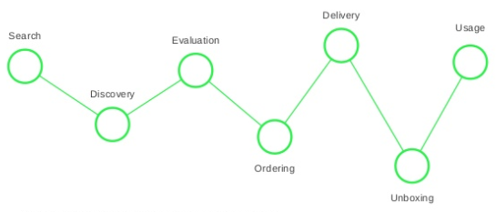

For the sake of reducing cart abandonment, you only need to consider from Search to Ordering.

Cart abandonment usually happens after the evaluation stage and prior to ordering. If the focus is only on this point, cart abandonment cannot be curbed effectively. Time and again, people will abandon carts and it will only worsen day by day.

You must make it a point to focus on the customer right from the start of the journey to reduce shopping cart abandonment.

It starts with sending a coupon with a welcome message, a sale email, product recommendations, then slowly moves on to abandoned cart emails, and the cycle repeats.

Each and every move must be made keeping in mind how to improve cart abandonment rate.

## 10 Proven methods on how to reduce cart abandonment rate

Presenting to you 10 cart abandonment tips that will revolutionize your eCommerce business for the better.

### Capture the email address of the site visitor

When it comes to an eCommerce business, email address plays a key role. It is a necessity for the eCommerce store owner inorder to send marketing details and keep the customer informed about happenings.

The scenario is different for a customer. Some willingly furnish email details by signing up as a member, whereas some others prefer to checkout as a guest. These emails from guests must be collected.

That is why popups are a must. Also, if you are pondering about how to improve cart abandonment rate, popups is one solution for it.

Having the email address of customers with their consent helps extensively to decrease shopping cart abandonment.

3 types of popups that are must-try are discussed here.

#### Welcome popup

A welcome popup comes up within 10s to 15s of landing on the home page of a website. Here is an example from Monoset.  

The sale intent starts here at the welcome popup itself by giving away an offer of 10%. The benefit is 3-fold here.

-   A person joins the email list.
    
-   The possibility of a sale is higher.
    
-   An abandoned cart email can be sent if the product is abandoned.
   

#### Email collection popup

Hasn’t the welcome popup worked? No problem. There is more on the way.

Email collection popup can be used to get an email from the consumer. It is also called as ‘add to cart’ popup.

The timing at which the popup is triggered is the highlight here. It triggers just when the consumer is about to add the desired item to the cart. It so happens that a majority of people will comply so as to finish the purchase.

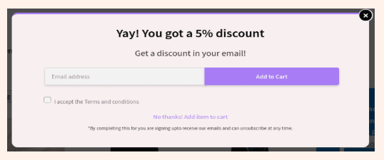

 

The above-given image is an <link-text url="https://www.retainful.com/docs/woocommerce/collect-email-address-before-adding-to-cart-in-woocommerce" rel="noopener" target="_blank">email collection popup</link-text> with a discount offer to get the email details of customers. Retainful helps create such popups with ease for WooCommerce.

#### Exit intent popup

Exit intent popups are the best of the lot when considering how to convert abandoned carts. They can convert 10 to 15% of people who leave an eCommerce website.

The exit intent technology tracks the movement of the cursor and brings up a popup when the site visitor decides to leave the page without any activity.

 

 <link-text url="https://www.retainful.com/docs/woocommerce/exit-intent-popup" rel="noopener" target="_blank">Exit-intent popups</link-text> are primarily of 2 types to recover abandoned carts.

-   One that simply collects the email
    

This kind of exit intent popup helps to reduce cart abandonment in eCommerce in the long run. The email is stored and used to send abandoned cart emails if a customer abandons a cart in the future.

-   One that entices to checkout instantly in the case of cart abandonment
    

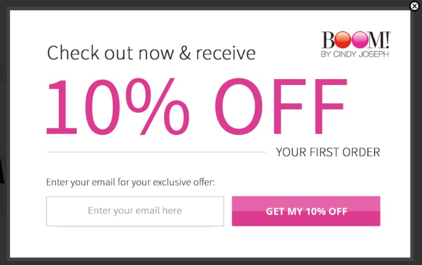

The above exit intent popup collects emails as well as nudges the customer with a discount to complete the purchase right away.

There is another variation of the same type of exit intent popup where only the discount offer or code is given but the email is not collected.

Fastrack, a digital marketing agency that caters to the hotel and travel industry, <link-text url="https://optinmonster.com/case-study-fastrack-recovers-53-percent-of-abandoning-visitors/" rel="noopener nofollow" target="_blank">recovered 53% of abandoning visitors</link-text>for one of their clients with the help of an exit intent popup that had only the promo code.

 

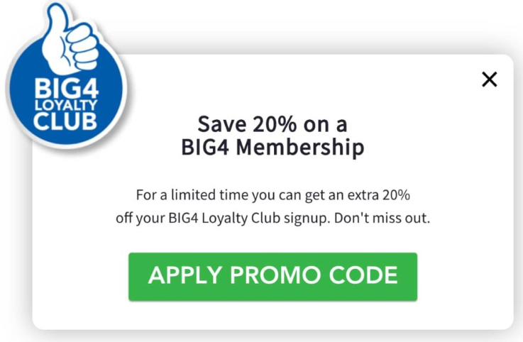

 

Exit intent popups of all these types, vital to recover abandoned carts, can be designed using Retainful. Check out the guide <link-text url="https://www.retainful.com/blog/how-to-setup-exit-intent-popups-for-abandoned-cart-recovery-in-woocommerce" rel="noopener" target="_blank">here</link-text>.

### Make good use of abandoned cart emails

 

There is no better strategy than sending out abandoned cart emails to <link-text url="https://www.retainful.com/product/features/woocommerce" rel="noopener" target="_blank">recover abandoned carts</link-text>. If you are seriously worried about how to reduce cart abandonment rate, then this is it.

Econsultancy has proven that abandoned cart emails can recover around 30% of abandoned carts. Why not go for it?

The basic elements that you will find in a winning abandoned cart email are

-   Subject line
    
-   Content
    
-   Product image
    
-   CTA
    
-   Discount / Review
    
Majority of <link-text url="https://www.retainful.com/blog/how-to-write-abandoned-cart-emails-in-woocommerce" rel="noopener" target="_blank">abandoned cart emails</link-text>  contain all of these elements in place to impress the customer which means it is the usual type.

Rather, why not think out of the box? That is what will make you stand out.

Nanoleaf had the guts to escape the maze of preconceived <link-text url="https://www.sendx.io/blog/abandoned-cart-recovery-email-templates-ultimate-guide/" rel="noopener nofollow" target="_blank">abandoned cart templates</link-text>.

The result?

Nanoleaf recovered 30% of abandoned carts.

Strategy used - humanizing the product.

Are you scratching your head? Look at this email to make it clear.

The header immediately catches the attention - Lonely….I am so lonely - which is a popular number by Akon. It is nothing short of a genius to use this as the header for an abandoned cat email.

Moving on, you will find that the product (a light) talks to the customer.

"I showered this morning...I am nice and clean...I want to come home with you!"

The product is personified with extra-ordinary content, thus giving it a human-like nature.

Of course, the cart details are present but they are not as significant as the content and CTA.

This proves content alone can turn things in your favor to decrease shopping cart abandonment.

 
### Generate next order coupons for customers who complete checkout

The process of trying to reduce online shopping cart abandonment is cyclic. It does not stop with recovering an abandoned cart with the help of abandoned cart email. Here is the flow.

***Abandoned cart > abandoned cart email > order placed > next order coupon with order email > new sale***

The new addition to this flow is the Next Order Coupon.

<link-text url="https://www.retainful.com/docs/woocommerce/next-order-coupon" rel="noopener" target="_blank">Next order coupon</link-text> is nothing but a discount that is offered to the customer to initiate the next purchase without much delay.

This coupon occupies a place in the order notification email of a completed order. A sample is given below.

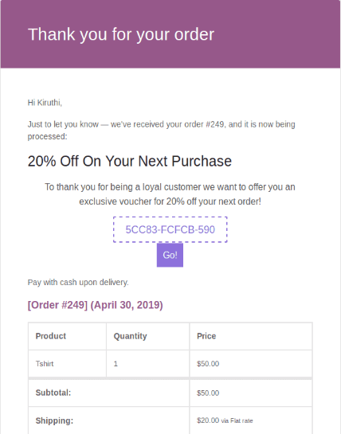

Expiry date for the coupon can also be set as per your needs. This tactic keeps cart abandonment aloof and increases sales.

### Shorten the checkout process

Checkout process must be like a breeze for the customer to handle. Otherwise, get ready to deal with checkout abandonment. The percentage of checkout abandonment, i.e, customers who abandon a cart at the checkout page is significantly lower compared to abandonments in the cart page.

  

For example, if 22,819 carts are abandoned in the cart page, the checkout abandonment will be around 3661. So much is the disparity but it cannot be ignored because the problem mostly lies with the design of the checkout page and not with the customer.

#### How to reduce checkout abandonment?

28% of people abandoned a cart due to long and complicated checkout, according to Baymard. The best way out is to shorten the checkout process.

The usual checkout flow that is most prevalent given below.

***cart > billing info > shipping info > shipping method > order preview > payment***

There are 6 steps in the above checkout flow. That is pretty long and tiresome for the customer to deal with.

How about bringing it down to 3 steps?

***shopping cart > billing & shipping info > payment***

Pepperfry does it this way. Take a look.  

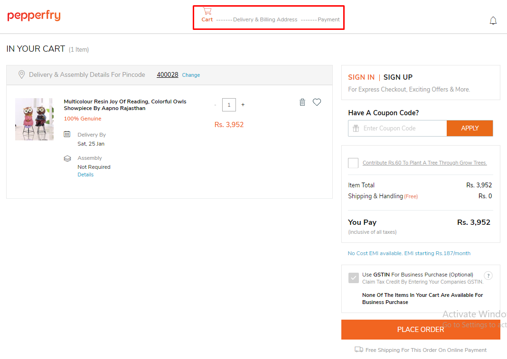

  
The above image is the cart page of the furniture and decor retailer, Pepperfry. It also has a progress indicator at the top which mentions only 2 more additional steps to confirm the order. There are 3 steps in total making the checkout a short one.

Then comes the shipping address page where you do not have to retype the address for billing purposes. Just click the checkbox ‘Billing address is same as Shipping address’.

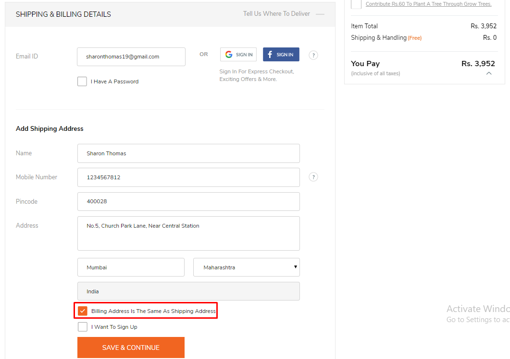

Next is the payment page.

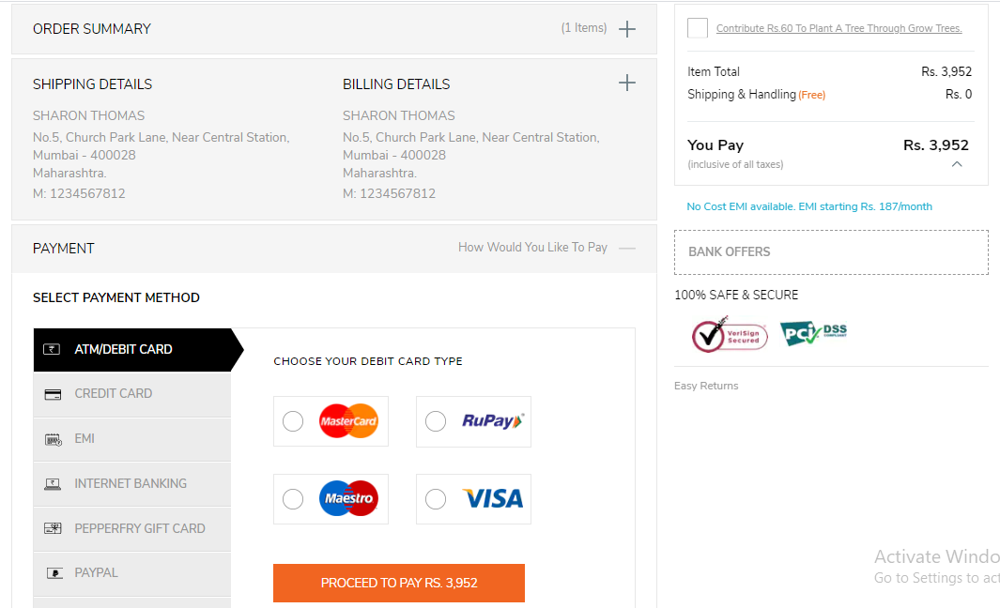

That’s it. You are done with the purchase with just 3 steps. Even though the steps are 3, all the information is present on the same screen which makes it even easier to edit items and address if needed. The need for an order preview page is eliminated here.

Other things to focus on to reduce cart abandonment in the checkout page are given below.

-   Reduce <link-text url="https://baymard.com/blog/checkout-flow-average-form-fields" rel="noopener nofollow" target="_blank">the number of form fields</link-text> from an average of 14 to 7.
    
-   Enable autofill option.
    
-   Enable express checkout for members.
    
-   Include trust seals to ensure safe payment.
    
### Advertise free shipping

The use of free shipping technique to reduce cart abandonment is a no-brainer. It simply works like a charm. Trailcampro, an online site that sells trail cameras increased sales by 20% with this method.

Shipping payment is one major objection that eCommerce consumers face. This is evident from the eCommerce cart abandonment statistics which reveal that 60% of people abandon a cart due to high extra costs that include shipping. In addition, <link-text url="https://www.uspsdelivers.com/curbing-the-cost-of-free-shipping/" rel="noopener nofollow" target="_blank">24% of people</link-text> are ready to increase the order value to avail free shipping.

With this in mind, there is no wiser option than to provide free shipping to curb online shopping cart abandonment. This brings up the next question as to how you should let consumers know about the free shipping option. They will have to know it clearly in order to avail it.

There are 5 ways of advertising free shipping on your website.

#### Free Shipping banner

A site-wide banner is one option to shout out about the availability of free shipping. Take a look at this example from Williams Sonoma.

Banners help consumers notice the deal quite easily irrespective of the page they surf but let’s not stop with just this one trick.

#### In website header

If your free shipping offer is going to be a forever affair, then you can pretty much add a copy of it to your website header like this one by Trailcampro.

As already pointed out, this minute change spiked sales by 20% for this US-based company which indeed sorted out shopping cart abandonment.

#### On product page

The aspect of free shipping must be reinforced in the minds of the consumer by mentioning it on the product page too. This pumps in more confidence for a quicker purchase without a second thought.

William Sonoma does it in 2 ways.

The first one is the free shipping highlighted right below the product image.

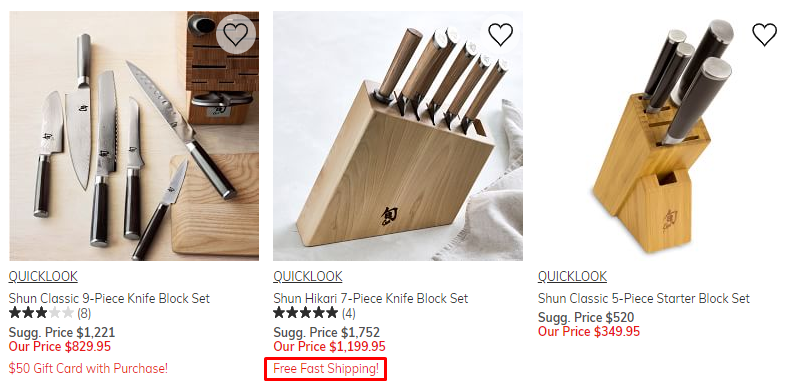

The second one is the offer mentioned in the specific product page.

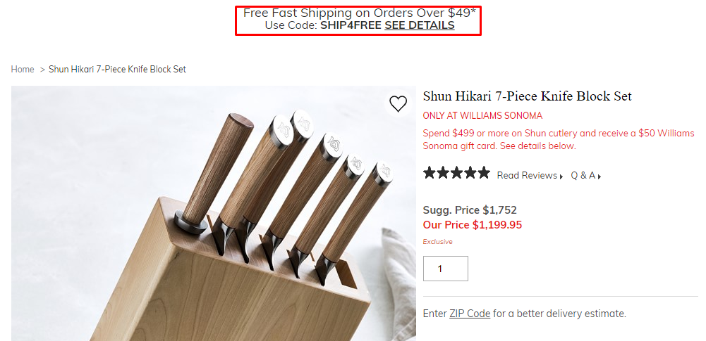

There is hardly any chance to miss the sight of the free shipping offer which means the chances of shopping cart abandonment is far lesser.

#### On Cart & Checkout page

 

If you are wondering <link-text url="https://www.retainful.com/blog/how-to-reduce-checkout-time-in-a-shopping-cart" rel="noopener" target="_blank">how to reduce checkout abandonment</link-text>, then include the message in the cart and checkout page too. Look at this shopping cart page from Amazon.

 

#### Exit intent popup

Consumers need not really love what they purchase, might switch decision at the last minute, and decide to leave just seconds before the checkout. This is the apt time for an <link-tetx url="https://www.retainful.com/blog/how-to-setup-exit-intent-popups-for-abandoned-cart-recovery-in-woocommerce" rel="noopener" target="_blank">exit-intent popup</link-text> that emphasizes free shipping. Here is an example by Sleeknote.

 

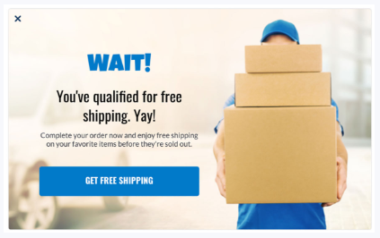

Moving on, here is an insight into how to set up free shipping offers. Here are some of the possibilities.

-   Free shipping for orders above $X.
    
-   Free shipping for X number of items.
    
-   Free shipping for the next X hours.
    
-   Free shipping for all deliveries to (country/state).
    
There are more options like combining free shipping with discount offers and so on. Just choose the type that helps reduce cart abandonment for your eCommerce store.

### Quicken the site speed

Patience is always tested when a website loads slowly and this can result in website abandonment. It is so unfortunate that a consumer comes all the way to your doorstep and leaves due to delay in page loading.

Reduce website abandonment by working on various technical factors of your eCommerce site. By the way, the <link-text url="https://www.shopify.com/enterprise/site-performance-page-speed-ecommerce" rel="noopener nofollow" target="_blank">preferred load time for 47% of online shoppers is 2s</link-text> or less. With a one-second delay, 11% of people abandon the website.

Here are some tips to increase page speed and decrease shopping cart abandonment.

-   Optimize images
    
Images constitute around 56% of content on a web page, according to Crazyegg. When image files are of large sizes, the load speed is hit leading to website abandonment. Keep the image sizes small by cropping the unnecessary portions. If page speed is the priority, stick to JPG formats for images that result in smaller file sizes.

-   Restrict the number of external plugins
 
External plugins are sometimes essential to provide better customer experience. Even then, too many plugins can create trouble by slowing down the page speed. Retain only the ones that are useful and worthwhile.

-   Keep a check on redirects and broken links
   
Fix all the broken links by reducing the number of redirects. Crackdown on redirects and point them to the new and relevant web pages.

-   Combine and minimize files that contain coding

HTML, CSS, and JavaScript files make up the website design. Combine all of the files after removing the unnecessary spacing and formatting.

-   Allow files to be stored in the cache memory of the user
   
This move benefits repeated website visitors who need not wait an extra 2 seconds for the server to download the files of coding and images every time they visit. Instead, these files are by default stored in the cache memory of the user. Just enable browser caching.

### Try out live sales notification

Reduce abandoned carts by using live sales notification for your eCommerce store. This eventually helps in combating the number of online shopping carts abandoned.

Here is an example from OptionMonster. The image shows their homepage with a live sales popup that comes up every other second.  

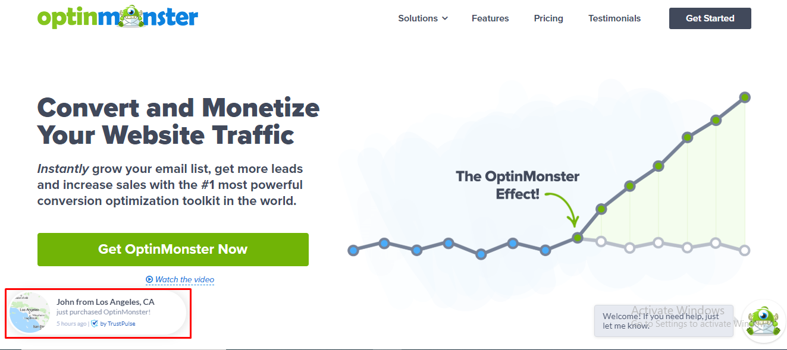

Sales notifications act as an alternative to social proof. When the consumer notices that so many people are opting for the service or buying a product, the chances of turning away are drastically reduced.

This concept is also termed as push notifications. While the names are many, the idea behind is the same.

The same technique can be used to target a particular product too like this one done by an online store called Seamstress.

It does not stop with the notification to let you know about the hot sellers. A click on it takes you to the product page too.

Live sales notification or sales pop can also be used to recommend products or upsell and cross-sell. <link-text url="https://beeketing.com/sales-pop" target="_blank" rel="noopener nofollow">Sales pop from Beeketing</link-text> helps do this seamlessly. The pops can be customized to show who has purchased, the time, the product, the place, or even the number of sales for a particular product.

 

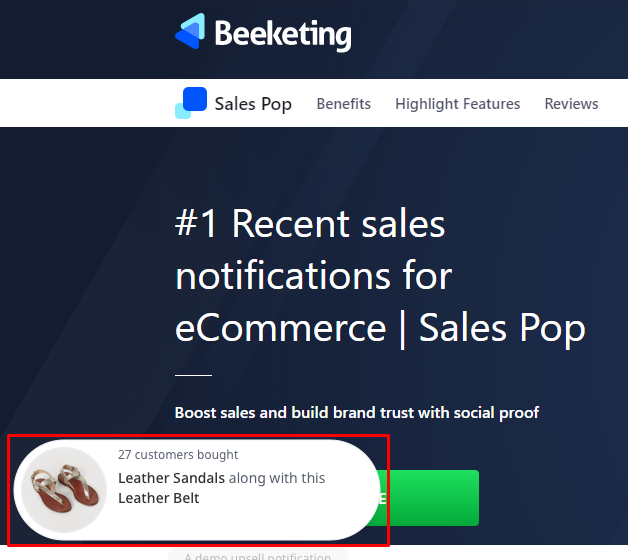

### Set up discounts wisely

 

Online shopping is all about discounts. This is why customers flock to eCommerce websites even before they plan to buy. Decrease eCommerce cart abandonment by <link-text url="https://www.flycart.org/products/wordpress/woocommerce-discount-rules" rel="noopener" target="_blank">applying discount rules to your WooCommerce store</link-text>.

That being said, what type of discount magnets customers the most?

There are 2 types of discounts - percentage based and flat rate.

**Percentage based discounts**

5% off, 10% off, 20% off - all of these fall under percentage based discounts. This is easier to set up compared to flat rate because the Average Order Value (AOV) need not be taken into account.

**Flat rate discounts**

$5 off, $10 off, $20 off - all of these discounts are categorized as flat rate. Any discount that mentions the amount that will be deducted directly is a flat rate discount.

Setting up flat rate discounts is a tedious process, especially if the eCommerce site handles everything from A to Z. This is because the AOV must be taken into account here. The AOV depends on the products the site sells. For example, the AOV for baby & child products is $246 whereas for health & wellbeing is $48.

Of the two, according to a study by Klaviyo, <link-text url="https://www.klaviyo.com/blog/abandoned-cart-discounts" rel="noopener nofollow" target="_blank">flat rate discounts perform better</link-text> to recover abandoned carts in terms of revenue.

These are some methods to reduce shopping cart abandonment effectively by leveraging discounts.

#### Advertise discount on home page

 

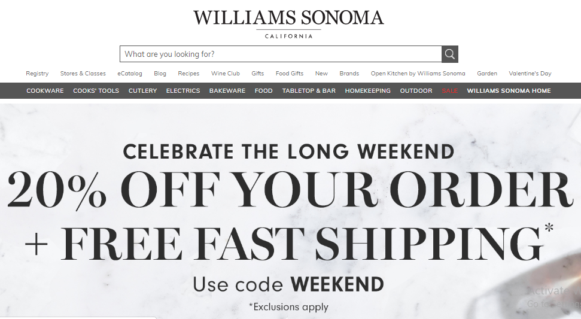

You will never see a bigger sale ad than this one by William Sonoma. There is not a chance of missing out on this. Customers start shopping happily with the discount in mind.

#### Use discounts in abandoned cart emails

Abandoned cart emails with discounts never fail if done the right way. Take a look at this example from Neiman Marcus. The first thing that you notice is the 10% off. That is exactly the intent of discounts. It should be noticed and utilized.

#### Mention discount on product page

It goes without saying that product pages must have mention of discounts. Williams Sonoma uses flat rate discounts on their product page.

Saving $100 with a purchase is no joke. This is definitely better than stating you get a 25% discount because you immediately get to know how much you are going to save with this purchase. The possibility of cart abandonment is very minimal here.

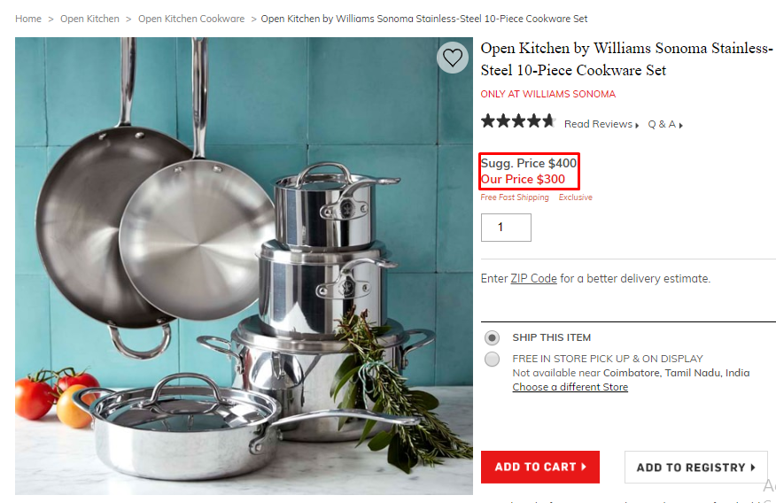

### Optimize for mobile commerce

It is no surprise that the mobile obsession is ever-increasing and so is the eCommerce sales on mobiles.

Here are some stats that prove mobile commerce is the future.

-   $626 billion revenue was generated in 2018 from mobile commerce
    
-   eCommerce sales from mobile will account for 54% of total sales by 2021.
    
-   Consumer <link-text url="https://www.thinkwithgoogle.com/consumer-insights/consumer-mobile-brand-content-interaction/" rel="noopener nofollow" target="_blank">interactions spike to 200%</link-text> when mobiles are used.
    
The message is clear cut that if your eCommerce site is not optimized for the mobile, abandoned carts will haunt you. Let’s think of how to avoid shopping cart abandonment in mobile.
Budapester, the German fashion retailer,<link-text url="https://www.growcode.com/budapester-mobile-conversion-rate-optimization-spcs/" rel="noopener nofollow" target="_blank">increased mobile conversion rate by 29%</link-text>. So what did they do to achieve this?

-   USP information like free shipping & delivery and discounts was made visible in the product pages by highlighting them.
    
-   The height of the site header was reduced. This was particularly needed for the mobile where other information on pages must be given focus rather than the brand name.
   
Other things to do to reduce eCommerce cart abandonment in mobile

-   Remove content that does not add value. Stick to the point.
    
-   Say no to popups and sidebars which are a hindrance for mobile users.
    
-   Keep the CTA size thumb-friendly.
    
-   Place checkout forms and CTAs where a person’s thumb reaches out instantly on the mobile. <link-text url="https://www.uxmatters.com/mt/archives/2013/02/how-do-users-really-hold-mobile-devices.php" rel="noopener nofollow" target="_blank">49% of people</link-text> prefer using the mobile one-handed, 39% in the cradled position, and 15% with two hands.
    

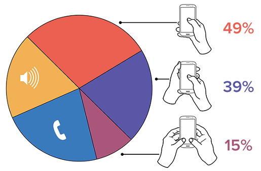

### Monitor live carts

 

<link-text url="https://www.retainful.com/docs/shopify/live-carts" rel="noopener" target="_blank">Live cart monitoring</link-text> is a much needed activity to keep a check on abandoned carts. Irrespective of all the cart abandonment tips that you follow, they are not going to work unless you are familiar with customer behavior.

With live cart monitoring you can

-   See what the customer purchases / abandons
    
-   Decipher why cart abandonment happens for a particular product
    
-   Develop a strategy to <link-text url="https://www.retainful.com/blog/how-to-recover-abandoned-checkouts-in-woocommerce" rel="noopener" target="_blank">recover abandoned checkouts</link-text> and reduce cart abandonment
  

## Conclusion

eCommerce model will never exist without a satisfied customer. Jeff Bezos says, "If you make customers unhappy in the physical world, they might each tell six friends. If you make customers unhappy on the Internet, they can each tell 6,000".

Planning to recover abandoned carts?

As already said, unearth the aspects due to which customers are affected or leaving without making a purchase.

Work on them. Create a cart recovery plan.

Set it rolling.