Gone are the days when businesses were about the boss and the employees. Tides have changed in favor of the customers ever since the introduction of the online shopping phenomenon into the busy lives of mankind.

With this, it is an open secret that the elixir to success in the eCommerce domain is being customer-centric. For this, a customer database is essential to reach out and the very first information that must be collected is the email ID. All other information comes secondary. It's like when you have the email ID, you almost have it all.

Email list building is the first and foremost work to be done. The point is there are many ways to create free email lists out there but only a few will show long term results.

Curious to know how to build an email list the right way? This post is for you.

<toc>
</toc>

## Why is an email list a pivotal factor for your business?

Email list building is the cornerstone of your eCommerce platform.

But why?

Because business comes to a standstill without customers and the best way to magnet more of them is by creating free email lists.

Being an online store, the easiest and affordable medium of communication is via email. Market your products, offers, seasonal sales, and what not via emails clearly and effectively. In addition, it is a golden chance to connect with customers at a personal level by sending customized emails.

The better you know your audience, the better will be the functioning of your online store.

----

## How to build an email list that lasts?

"FREE email lists available here! Hurry Up!"

You might want to stride up to the person selling these email lists and own the whole collection available.

NO NO NO!

Never ever commit the mistake of buying email lists. You will regret it later on.

### Disadvantages of buying an email list

-   You are not familiar with the information of people in the list starting from the name, age, to the background and interests.
    
-   It remains a mystery if these people are really interested in your business, be it products or services.
    
-   Without knowledge of all these, all your marketing strategies can never be targeted and they will fail. Eventually, your email list will shrink.
    
-   You are not the only buyer of the email list. Without exclusivity, the competition to reach the masses is higher.
    
-   You lose time and money.
    
Instead, work from the ground up to create your own email list and be proud of it.

### Advantages of creating an email list from scratch

-   You choose your audience and so you know them pretty well.Say, if your eCommerce store sells sporting gear and you want more people coming in. In this case, when you have a bulk email list, chances are that only 20% of them are interested in sports. On the other hand, when you try to communicate only with people related to sports, the percentage of email collection skyrockets.

-   Target marketing gets easier here bringing in more sales and revenue.
    
-   You own a unique group of customers.
    
-   The possibilities of unsubscribing are way too lesser. Hence, the retention rate of email sign ups increases dramatically.
    
-   Email list building efforts are paid off.
    
Convinced? Go on, then.
  
----

## How to entice email sign ups faster?

No one is going to sign up just for the fun of it. Customers nowadays are clever and they do expect something in return for signing up. It can either be any monetary benefits in the form of discounts, quality service, or valuable content that benefits.

Now that you know the customers' expectations, these can be used as a bait to bring them on board. Let's see how it must be done.

### CTA copy

"Join our mailing list"

"Submit your email"

"Register with us"

Boring, right?

These are some common CTAs that you will find all over the web. Common means being repetitive in nature. Loads and loads of CTAs with the same CTA copy.

Brian Dean, the founder of Backlino, complies. He says that there are 256,000 buttons on the internet that use the same CTA copy.

You need to be creative to get out of this maze. Try something new and see signups coming your way faster than ever.

Here is an exit intent popup example from Shopify Plus.  

 
Get the truth, not "tips".

Who wouldn't sign up for this? This is such an impressive CTA copy that assures delivery of valuable information. The design too is minimal and to the point. No fluff.  

Either get creative this way for you CTA or <link-text url="https://backlinko.com/list-building" rel="noopener nofollow" target="_blank">use value terms</link-text> as Brian Dean points out.

He specifically mentions 8 terms that strike the chord for easy-peasy signups. They are

-   Download
    
-   Access
    
-   Limited Time
    
-   Special Offer
    
-   Secrets
    
-   Advanced
    
-   Featured
    
-   Exclusive
    

### Incentives as a bribe

It's raining discounts and customers are always after it. Give them one to sign up. Nothing wrong.

  

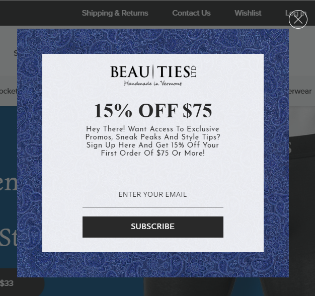

The perfect example of an incentive for email list building is shown here by Beauties. The incentive grabs the attention at first sight and then the rest. Only if the CTA had been a better one.

The truth is that customers will not bother about the CTA copy in this case because the value is already stated with a shopping discount.

Exclusive content alone can drive sign ups too, like this exit intent popup from Invesp.

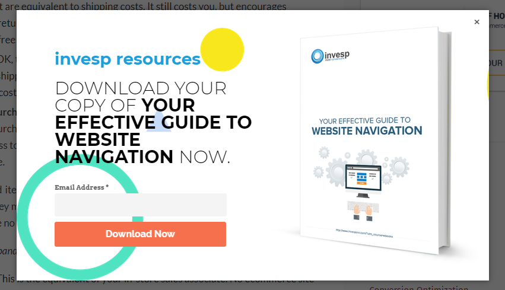

There is no monetary benefit here but the immediate access to the website navigation guide makes it work.

### Social Proof

"100+ companies increased conversions by using techniques from this guide."

"1000+ samples of the product sold out."

Numbers are a favorite among customers. Use them in your social proof to increase traction with email list building. Here is an example from OptinMonster.

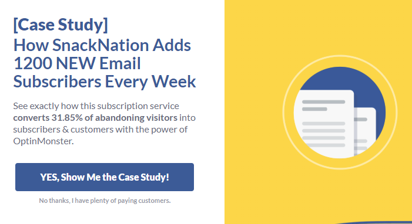

A case study of their client is used here as social proof to create free email lists. The number of email subscribers and the percentage of conversion is highlighted to show the result produced. The data from the case study itself testifies for the value of signing up.

The 3 methods of enticing sign ups - interesting CTA, irresistible incentive, and real social proof can be used across all 10 strategies, coming up next, to generate an email list.

___

## 10 Strategies on How To Create An Email List Organically

The title says it all. Without further ado, dive in.

### Reach out via social media

Social media drives customers' lives nowadays. The medium trashes, dictates, empowers, trolls, educates - it's just all in one.

As per stats, there are <link-text url="https://www.oberlo.in/blog/social-media-marketing-statistics" rel="noopener nofollow" target="_blank">3.5 billion social media users</link-text> worldwide as of 2019. Nearly half of the world's population is at the behest of social media.

One more stat.

GlobalWebIndex says, 54% of customers research through social media to look for the apt products.

This is where your prospects lie. Utilize it.

Start with Facebook because it is, without a doubt, the market leader for connecting socially.

Here is an example of a Facebook post to build an email list.

This post by Asana uses social proof to stress on the effectiveness of the app to organize work. It uses a simple sign up CTA but the ad copy (simple, clear-cut) makes it a compelling one to subscribe.

### Intrigue your audience with a quiz

Quiz is the best way to read your customers' minds and expectations. Information collected here can be used wisely to provide better customer satisfaction, personalized content, and service.

But it does not stop there.

A quiz or survey form also doubles up as an email sign up form. This can be used to build an email list and to grow it steadily. Checkout this quiz from Neil Patel.

This pop up comes up within minutes into the UberSuggest page by Neil Patel. It addresses the issue of building traffic and he says he can make it happen in less than 30 days.

One might think that the quiz might be time consuming for something this serious. This objection is also addressed here by mentioning 'Takes 3 minutes'.

On clicking 'Start', the quiz screen opens up.

 
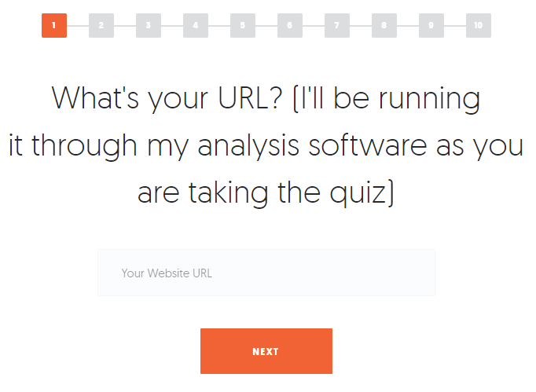

It has 10 questions about current traffic, use of google analytics, number of blog posts published monthly, SEO, paid ads, revenue generated, and marketing. The information is also assured to be confidential.

After the 10th question, this comes up.

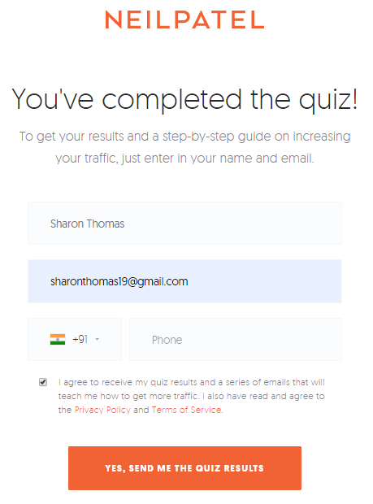

The email address is collected to send the detailed analysis and step-by-step guide based on the quiz answers.

Pretty clever tactic to build one's email list.

Tips to nail a quiz

-   Tap into the emotional intelligence of the customer or ask questions that reveal data. In the above, the data is extracted from the customer. This way he feels engaged completely and the possibility of email submission is higher.
    
-   Keep the quiz or survey short and sweet. Lengthy ones irk the customers.
    
eCommerce stores can get information about customer service, website navigation, and even nudge to submit a review with a survey form.

### Design a tool that assists

Tools to better the eCommerce trade are evolving from time to time. Some are costly. Some can be used for free.

By why make it free without expecting anything in return?

Simply collect the email address to send results from the tool used.

Here is a company that specializes in bettering customer conversation for eCommerce and they emphasize on using live chats.

This popup comes up when trying to exit their page.

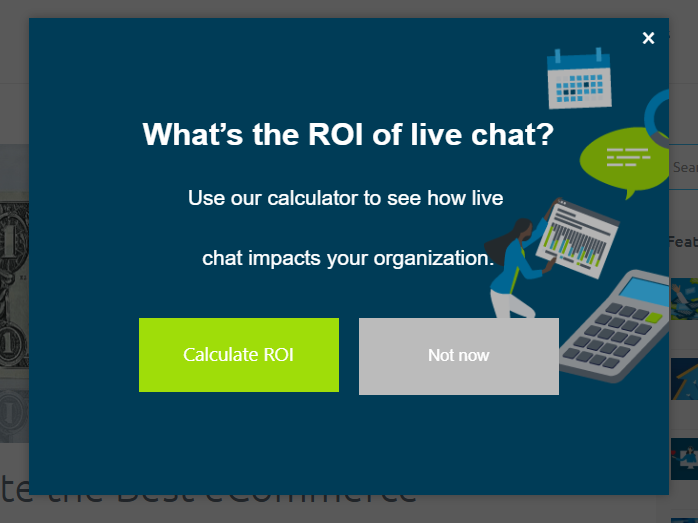

The company suggests calculating the ROI for implementing live chat for a business.

This takes the customer to another page shown below.

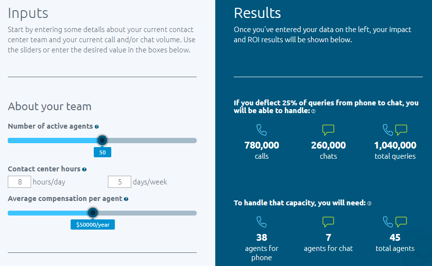

The input is given using sliders and once done, the results appear on the right half of the screen.

After checking the results, an email submission section can be seen at the bottom of the page in order to download the results.

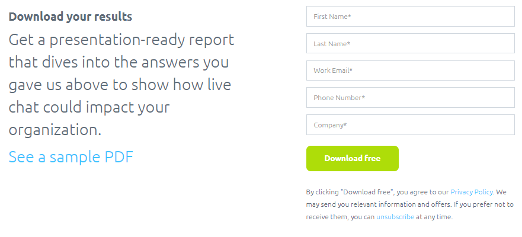

The idea here is that when someone spends time using the ROI calculator tool to see the results, the involvement is real and so he wouldn't mind spending another minute to key in the email ID. A thoughtful way to create free email lists.

For an deCommerce store, a tool for product price comparison is must nowadays with thousands of products available in just one place. Emails can be collected by providing a discount offer to be used immediately.

### Don't ditch the basic opt-in form

The basic opt-in form is where it all started and it is used even now by most online stores to get email sign ups.

Let's take a look at a very basic form. It is set in the footer of the website with other navigational links. The footer section is static and comes along all pages of the website including product pages. 

Madewell shows how to do it.

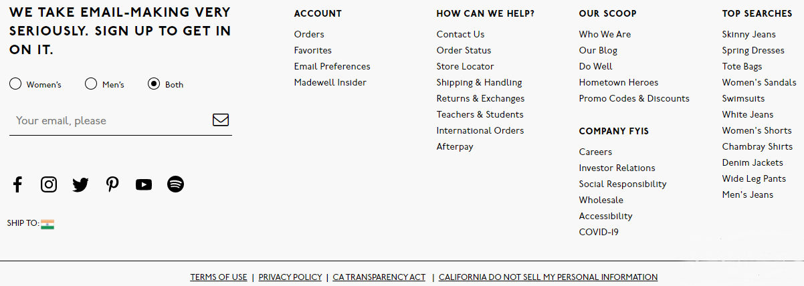
  

### Create multiple landing pages

Landing pages are hidden gems. They are made for a specific purpose and it can be utilized to drive email sign ups too.

But why multiple landing pages?

Because all customers are never the same. Say, you have a pool of 100 customers, only a fraction of the whole (about 10 or 20) will be like-minded. The rest of the people also differ on various aspects like expectations.

So, if you want a huge volume of sign up, you need to create multiple landing pages with different designs and attributes. Slack nails it.

**Slack landing page 1**

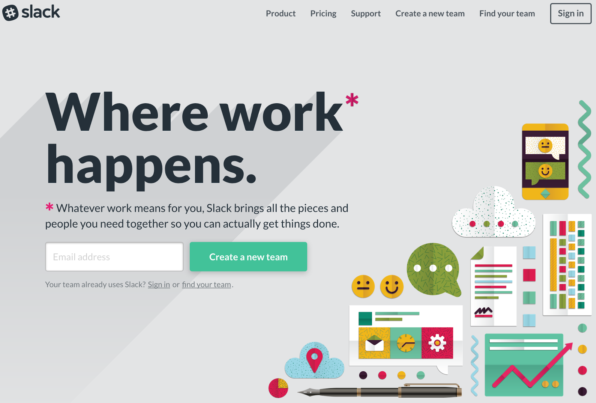

  
**Slack landing page 2**

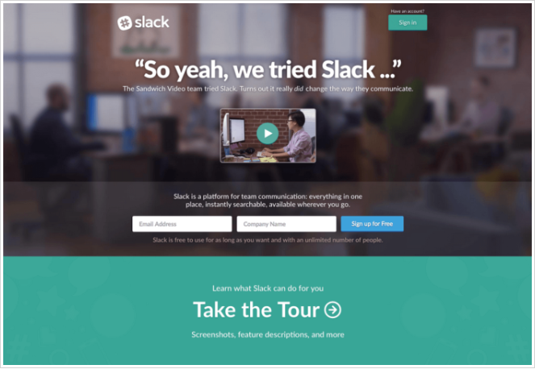

As you can clearly see, these are two phenomenally different landing pages from Slack to create free email lists. While the first one subtly describes what Slack is all about, the second one has a social proof and a product video tour too. What connects both the landing pages is the prominence of the email sign up boxes and CTAs.

Time and again, the landing pages must be re-designed and kept alive to stay ahead of the changing trends in the industry.

### Optimize your About page

The 'about page' of an online store is sometimes underrated. A person going through the page indicates some keen interest in making a buy.

Including an email sign up section at the end of the 'about page' is a good way to on-board these customers quickly. This makes sure that you do not miss on someone worthy of being added to your email list.

Autogrow uses this as one of the methods to create an email list.

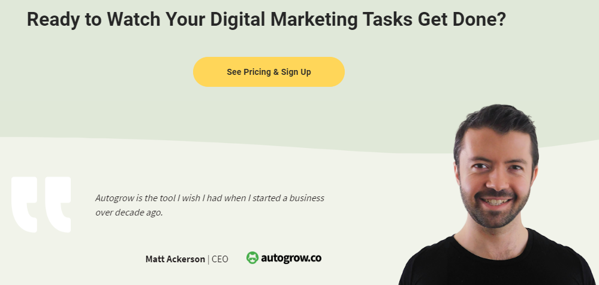

### Use your blog posts for sign ups

Blog posts too hold the key to generating desired email lists. Want to know how?

Retainful does it this way.

  
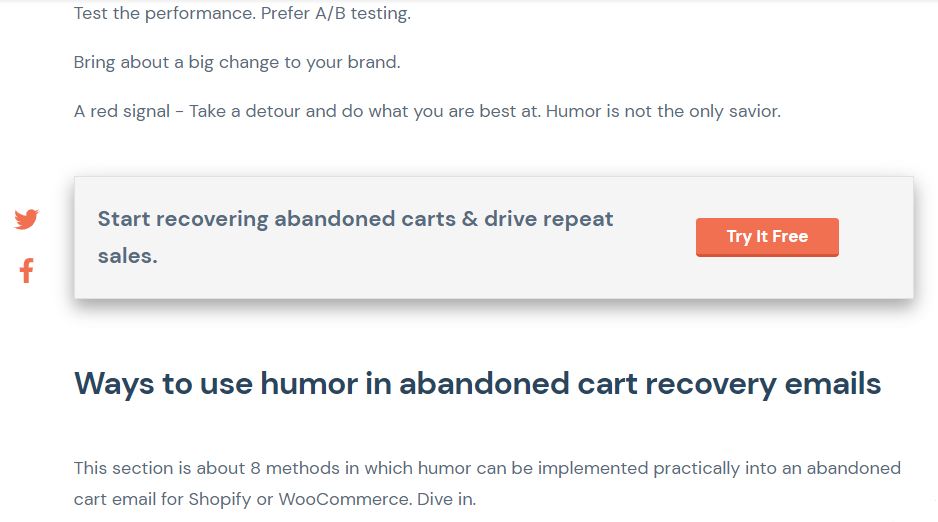

  
 

'Try It Free' CTA button is positioned in the middle of a blog post dealing with <link-text url="https://www.retainful.com/blog/how-to-use-humor-in-abandoned-cart-recovery-emails" rel="noopener" target="_blank">how to use humor in abandoned cart recovery emails</link-text>. 

The CTA then takes the customer to the log in / sign up page.

One thing to consider is the positioning of the CTA must be in a relevant blog post. There is no point in trying to get email sign ups for an abandoned cart plugin in a post related to Instagram stories.

### Scale higher with Exit intent popups and slide-ins

 

Exit intent popups are meant for <link-text url="https://www.retainful.com/blog/how-to-setup-exit-intent-popups-for-abandoned-cart-recovery-in-woocommerce" rel="noopener" target="_blank">abandoned cart recovery</link-text>. In addition, they are also meant for email collection.

You did see many exit-intent popups earlier in this post. Now, one more, with a difference.

This is a type of 'play a game' or 'spin the wheel' exit intent popup. This is an example from MonsterInsights.

The customer spins the wheel to avail an offer. This is called gamification. Oh yeah, that is the trending term used for this aspect.

Even though some consider exit intent popups as annoying, they are incredibly effective for any industry having online business.

For those who are not fans of exit intent popups, slide-ins do a decent job of taking screen quietly by the side. Hubspot uses this technique to create free email lists with a content upgrade.

### Come up with a giveaway

Customers love freebies. When it is given as part of a contest, they are always enthusiastic to take part in it.

You can very well build an email list without much hassle here. The reason you can give is to announce the winners of the giveaway or send a link to the contest page. Customers will never think twice and they comply. Both sides win here.

Design Within Reach demonstrates it well.

### Encourage Referrals

Referrals are the digital form of word-of-mouth marketing. The only downside is that this strategy cannot be used by a store without access to an existing email list.

Referrals, one among the <link-text url="https://www.retainful.com/blog/boost-your-ecommerce-growth-with-loyalty-program" rel="noopener" target="_blank">loyalty programs</link-text>, must definitely be used as the last strategy when you think of how to build an email list. Make sure that you give an incentive to both the existing customer and the new-referred customer.

Koodo Mobile brought in <link-text url="https://www.buyapowa.com/blog/referral-program-examples/" rel="noopener" target="_blank">75,000 new customers</link-text> in two years by using a referral program. They gave a $25 off for both the existing and new customer. Here is how their referrals page looked like.

 

The type of incentive is absolutely your choice. You can also opt for percentage discounts, free shipping and delivery, and even free sample products.

## What's next?

Once your email list has been created, make it a point to do the following regularly.

-   Segregate the list for targeted marketing
    
-   Check for duplicates and spam emails
    
-   Remove inactive customers in the long-term
    
-   Keep the email list healthy
    
## Summing Up

There is never an end to email list building. Just keep adding customers to the current list and keep them satisfied to retain them life long. Your email list must see a steady and exponential growth over the years. This is how you will create a good rapport with your audience.

Either fulfill the needs of your customer and boast about your email list or defy them and go down the drain. Afterall, no customers mean no business.

The choice is yours.
 