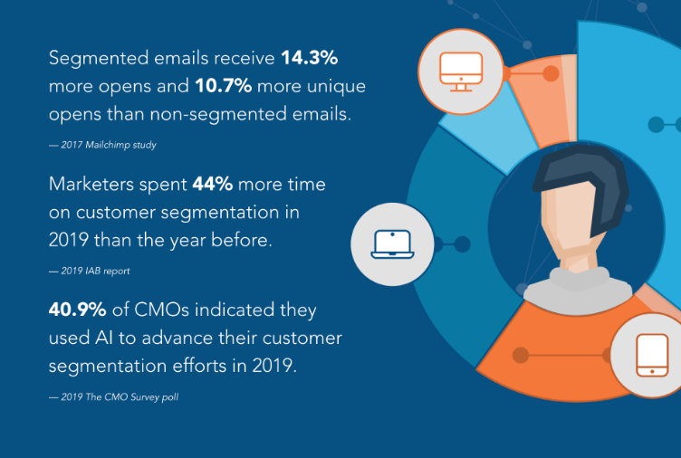
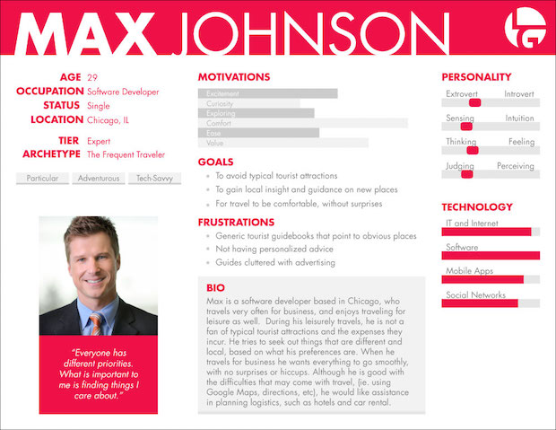
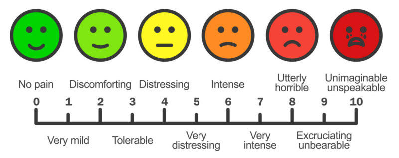
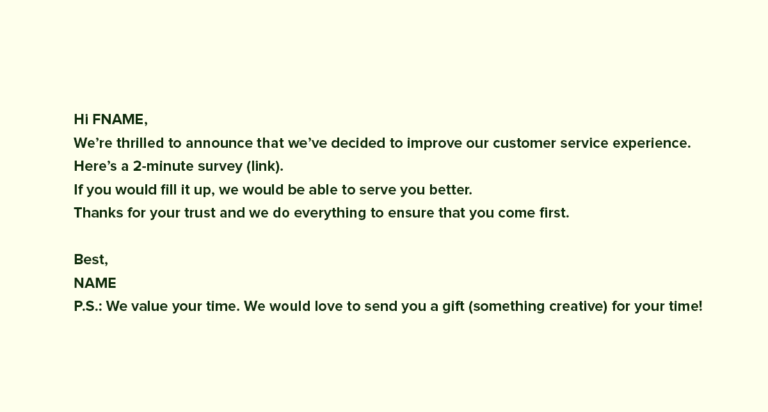
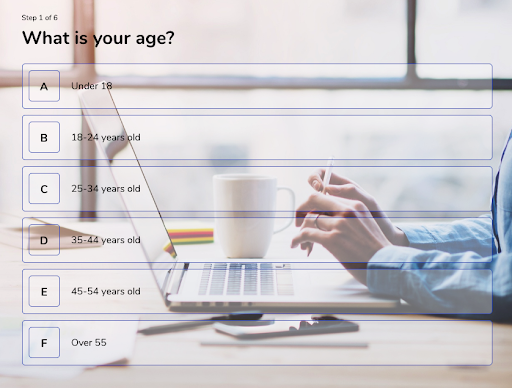
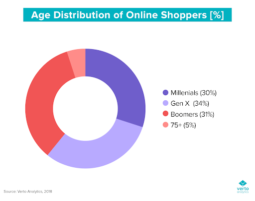
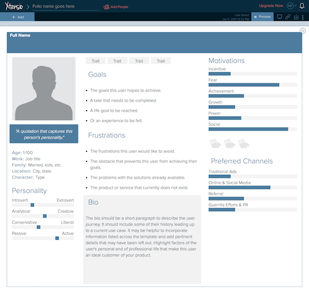

Are you worried that your marketing campaigns are not yielding conversion? Who are your ideal buyer personas?

Even though you run outstanding marketing campaigns, your sales are low and your ROI isn’t getting any better. Do you know what a few eCommerce stores do to tackle this situation?

They initially perform a survey to identify their potential customers, to build ideal buyer personas to increase their conversions.

So, you may ask, how to build buyer personas?

We have a strategy to build your ideal buyer personas, so we thought of sharing our traits with you. Dive into this article as we take through five easy ways to build ideal buyer personas. 

<toc>
</toc>

## What are Buyer Personas

A buyer persona is the fictional depiction of your ideal or target customers based on the buyer persona research you made. The research is carried out on the respective market and also on the existing customers of your Shopify store.

A healthy reminder, your buyer or marketing persona should never be built on a specific individual rather it should represent a group of potential customers.

## Why create buyer personas for your eCommerce store?

For instance, you may know who your potential customers are but do you know their personal interests? Do you know what they need? To answer these questions is why you need to build buyer personas for your Shopify store.

Buyer persona research is a great way to get to know your potential customers. It helps you to strategize your campaign based on their interests, you can direct your content and services based on their behaviours.

Creating ideal buyer personas exposes who your marketing to so that you can initiate your marketing campaign based on those buyer personas.

## How to build buyer personas for your eCommerce store?

### Perform an audience research

The initial step in building buyer personas is conducting a complete buyer persona research on your audience. You can discover interesting information about your customers, which you didn't know before, by studying your audience.

So, how to research buyer personas?

Start with your existing audience, find out how they have perceived your content before if your results aren’t bright, then change your content strategy.

 

See who your best customers are, find out what your best and also repeated customers have in common.

These buyer persona research will show who you should target on your next campaign to increase the sales of your eCommerce store.

By now, you’ll be wondering how do I gather this information?

**Create a survey :** Your existing customers will already be satisfied with your service so it gives you a great opportunity to learn more about them. Create a survey though your Social media and find out what interests/disinterests them.

**Face-to-Face interviews :** A conventional and effective way to garner information if your budget permits. You can know in-depth about their frustrations, interests and goals through focus groups and interviews.

**Cross-check your analytics :** There are many analytics tools that can furnish you with details of who are interacting with your site from where and when. These demographics can help you tailor your content.

**Phone calls and Emails :** You can always use the conventional method of a phone call or an interview. But most B2B marketers nowadays use emails to gather customer information.

 

To collect information with minimal effort, conduct a survey by sending a few questions to your <link-text url="https://www.retainful.com/blog/10-steps-to-build-your-email-list-2020" target="_blank" rel="noopener">email list</link-text>. Questions like,

1.  What objections do you have for our product?
    
2.  When do you open your emails?
    
3.  Do you have any questions regarding our services?
    
4.  How do you prefer to communicate?
    
5.  What questions would you ask yourself before buying a product?
    
6.  What are the challenges you face?
    
These are the few questions we ask our customers to build our ideal buyer personas. We hope we showed you how to research buyer personas now let’s jump into segmenting them.

### Segmenting your buyer personas

Now that you know how to research buyer personas and have collected all the necessary information, the next step in how to build buyer persona is to segment it.

Our main motive is to build a target audience, so without segmenting your information you cannot narrow down your audience.

**Why should I segment my audience to send emails?**

 

If you don’t narrow down your audience you’ll be targeting your content to the wrong audience.

<link-text url="http://valcort.com/5-ways-to-segment-customers/" target="_blank" rel="noopener nofollow">Audience segmentation</link-text> allows you to tailor your message to the needs and interests of each and every customer.

This is a great way to touch the pain points of every customer and increase your engagement which eventually boosts your conversions.

For instance, imagine selling a tech device that appeals to tech lovers. If you don’t segment your customers before sending emails they will reach the inboxes of non-techie customers which will get them frustrated.

So, avoid frustrating and start segmenting.

  

 

This is how <link-text url="https://www.retainful.com/" target="_blank" rel="noopener">retainful</link-text> segments and creates buyer personas based on the information we received,

-   Demographics
    
-   Frustrations or pain points
    
-   Goals
    
-   Interests
    
-   Revenue
    
-   Email Preferences
    
So it is easy for us to tailor our messages to our segmented target audience to <link-text url="https://www.retainful.com/blog/ecommerce-email-campaigns-that-could-help-your-drive-conversion" target="_blank" rel="noopener">achieve better conversions.</link-text>

### Focus on customer frustrations/pain points

What troubles are your customers facing? What keeps them from achieving their goals? You need to ask these questions if you want to engage with them better.

A customer frustration/pain point is the issue that your customers are facing which can be resolved with your products.

 

Acknowledge their pain points, it will make your promotion easy. Moreover, people will be willing to buy from you if you can effortlessly display how your products can solve their issues.

To understand their pain points you need to know the types of pain points they face. Through our experience, we classified pain points into three types,

**Based on price** - Your potential customers are investing too much in their current product, now they’re looking for a cost-effective alternative.

**Based on products** - Your potential customers are looking to spend their time efficiently on a better product.

**Based on Support** - Your potential customers aren’t satisfied with the customer support they get on their current product.

Classifying their pain points in categories will help you to devise a plan, through which you can take your products to your potential customers to solve their frustrations.

The next challenge is, <link-text url="https://surveysparrow.com/blog/guide-finding-customer-pain-points/" target="_blank" rel="noopener">identifying their pain points</link-text>.  

 

 

You can use the time tested method of sending an email and asking them about the issues they are facing. You can also tell how you can solve their issues.

These are the effective ways we use to identify customer pain points,

-   Sending an email and asking them directly.
    
-   Initiating research on our audience.
    
-   Asking them through chat or phone calls.
    
We succeeded in identifying their pain points by employing these tactics, you can do it too or you can try experimenting with your resources too.

Always remember, the more you invest in the satisfaction of your potential customer, the more conversions you get. So, go ahead.

### Identifying your customer goals

We have seen the customer pain points, now it’s time to flip the coin, customer goals it is.

Customer goals are what they need or what they are trying to reach/achieve. These goals might be personal or professional depending on their position.

Now you’ve to see how your eCommerce product can help your customer in achieving his/her goal. Even if your products don’t relate to their goals it will help you get a better understanding of your customer.

A better way to approach this strategy is by anticipating their goals or needs.

An interesting aspect of anticipating customer’s needs is that you can tailor your content, or even add some more features to your product to reach their goals.

Here is how you can identify customer goals,

1.  Focus groups
    
2.  Social listening
    
3.  Keyword research
    
Social listening is a great way to identify customer goals because your sales teams know how customers react to your products so ask them and learn what your customer needs from you and act.

### Creating buyer personas

So, now you’ve collected all the necessary details like demographics, pain points, and goals, let’s move on to the next step by assembling them to build personas.

Wait, how do I get customer demographics?

Glad, you asked.

You know, asking for an individual’s age, their location might feel awkward for both parties concerned. In that case, you can always conduct surveys to find out those details.

 

Because people will feel comfortable to disclose these pieces of information through a survey rather than in personal communication.

 

Back to creating personas, a major question that arises when creating a persona is, how do I assemble these details to build ideal buyer personas?

Pretty easy, just look for the customers that have similar interests, goals, or pain points and sort them as an individual persona. Look for people who share similar demographics and sort them as a different persona.

Effortless, isn’t it? Your task would be even easier if you use a buyer persona template.

 

A best practice is to give your persona a name and a live picture so your team will get a fictional representation of who they are targeting with the campaigns.  

## Buyer persona questions

In the above segment, we showed you how to research buyer persona, most eCommerce stores follow these 5 easy steps to build their ideal buyer personas.

So, now let’s look at the heart of a buyer persona research, ‘questions’. Without buyer persona questions you won’t be able to achieve formidable success in your research.

We thought of sharing our list of questions that we use to collect necessary information respective to buyer personas.

These questions are segmented for your understanding, remember these questions can help you get in-depth details respective to a customer.

**Demographics**

-   What’s your name?
    
-   How old are you?
    
-   What’s your gender?
    
-   What is your ethnicity?
    
-   Where do you live?
    
-   What is your income?
    
-   What is your highest education?
    
-   Which city do you live in at present?
    
-   Which state are you living in right now?
    
-   What is your marital status?
    
**Education**

-   What kind of school did you go to?
    
-   Was it public/private or national school?
    
-   Did you go to college?
    
-   What was your major? Why did you choose it?
    
-   How was your school performance?
    
-   How was your school social life?
    
-   How good were you in extracurricular activities?
    
-   What was your average school grade?
    
-   What's your remarkable accomplishment at school?
    
-   Did you face any school difficulties?
    
-   Which topics have you excelled in?
    
-   On which topics did you struggle?
    
-   What are your favourite memories of childhood?
    
-   What was your favourite childhood activity?
    
-   While in college, what were your aspirations?
    
-   What did you do without going to college?
    
-   If you didn’t go to college, what did you do after high school?
    
**Employment**

-   What was your first job?
    
-   Which industry did your first jobs belong to?
    
-   What was your first income?
    
-   What is their actual working title?
    
-   What plans have you made to pursue your dream job?
    
-   What kind of business are they actually in?
    
-   Are you considering a shift in your career?
    
-   What's your dream job?
    
-   How long have they operated in their current company?
    
-   How many promotions have been issued, if applicable?
    
-   What was the situation that contributed to their present job?
    
-   How many men, if any, are under them?
    
-   What is the essence of their daily work? Is it managerial? What are the core everyday tasks?
    
-   What are its strategic responsibilities?
    
-   How much do they earn each year?
    
-   How is your boss?
    
-   How much do you like our work environment?
    
-   How does your salary contribute to your monthly expenses?
    
-   If you could, what would you change about your job?
    
-   What's your career path like?
    
-   What work-related associations are you involved in?
    
-   When are you going to retire?
    
**Personal behaviour**

-   How will you describe your personality?
    
-   Who do you look up to?
    
-   Are you optimistic/pessimistic
    
-   Who knows you very well?
    
-   What do your friends and colleagues say about you?
    
-   What are the things you are most proud of?
    
-   What was your biggest success?
    
-   How did you attain that success?
    
-   What was your biggest failure?
    
-   What did you learn from that failure?
    
-   What is your present obstacle?
    
-   Are you an introvert/extrovert?
    
-   What was the refreshing period of our life?
    
-   How adaptable are you?
    
-   Do you watch sports? Which are your favourite sports?
    
**Technology**

-   How savvy are you with technology?
    
-   What is your favourite social media app?
    
-   What do like about social media?
    
-   How often do you read tech blogs and articles?
    
-   What software do you use?
    
-   What devices keep your day alive?
    
-   What is your favourite communication medium?
    
**Purchase behaviour**

-   How often do you shop?
    
-   How frequently do you visit the eCommerce store?
    
-   What is your favourite store?
    
-   How much do you spend on average?
    
-   How safe do you feel about eCommerce products?
    
-   Have you experienced any security issues on payment gateway?
    
-   What was your recent purchase?
    
-   How important is it to make a good deal for you?
    
-   What device do you use for shopping?
    
-   Have you been scammed before?
    
-   Do you believe the quality of products on a sale day?
    
-   How much are you attracted to offers?
  
**Frustrations and Goals**

-   What frustrations do you face in you life and career?
    
-   What frustrations yo face while shopping?
    
-   What are your life objectives?
    
-   How about your career goals?
    
-   What gives you anxiety?
    
-   What are your biggest worries?
    
-   What makes you sad?
    
-   What do hate about our job?
    
-   What do you love about your job?
    
-   What are you least bothered of?
    
-   What political frustrations do you have?
    
-   What's the worst work you can imagine?
    
-   What's the worst customer service experience you've ever had?
    
-   Which kind of purchase did you regret most?
    
These are the set of questions that we use to collect our information to build an ideal buyer persona. Asking these questions will really show you why you should create buyer personas to boost your marketing campaign.

## How necessary it is to build buyer personas?

It is pretty necessary, without a buyer persona your marketing team will not know whom or where to target your content. Remember, if you want to sustain your business for a long time then buyer personas is the key to longevity.

If you’re still doubting over whether or not to create a buyer personas, these benefits will help you clear your mind.

Know your customer better - Buyer persona research can help you learn about your current and potential customers better. Their habits, behaviour, interests can be identified, knowing these can boost your engagement.

**Tailored marketing** - Your should target your campaign to the right customers to yield better conversions. By performing a buyer persona research you’ll know who your right customer and tailor personalized contents to keep them engaged.

**Enhanced efficiency** - With buyer persona, your campaigns will hit the right target with less waste, sometimes leading to more sales without any extra effort or expense on your part. You can save both investment and time.

**Overcome obstacles** - When you research your audience you can understand their goals and pain points so that you can prepare your content and product to solve those troubles they face.

**Eliminate negative personas** - A negative persona is the polar opposite of buyer persona. You should identify this so that you don’t target your content to them because they simply won’t purchase from you.

## Wrapping up

No more worries about marketing campaigns not yielding projected conversions. Create your ideal buyer personas and project your content intended for the right audience.

We believe this article showed you how to research buyer personas and how to build buyer personas. We crafted this article based on our experience on buyer persona research to target our marketing campaign to its intended audience. It’s time for you guys to do it too.