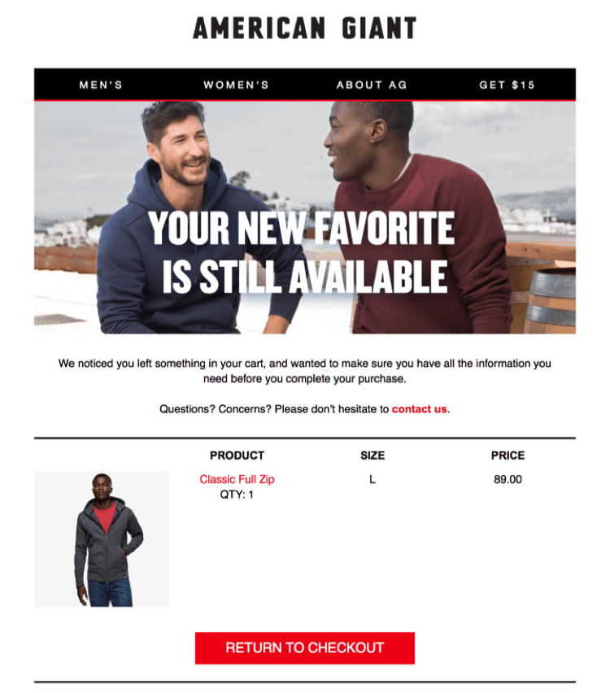
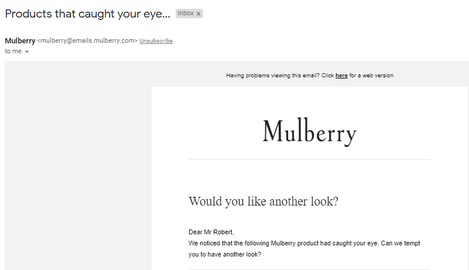
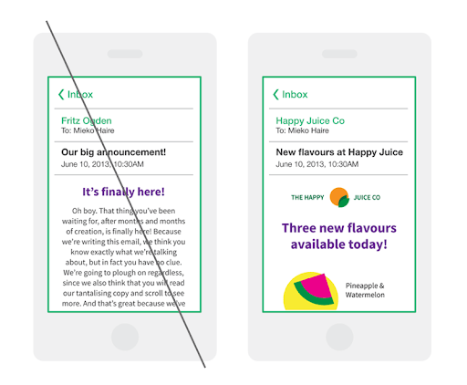
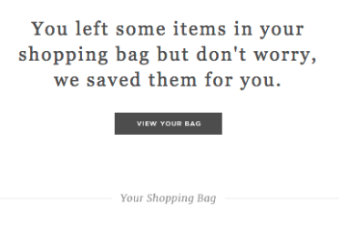
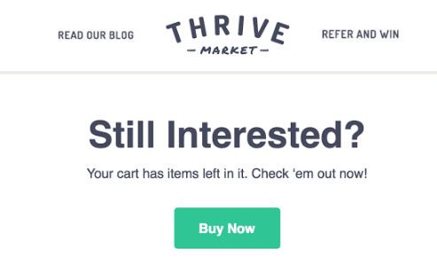
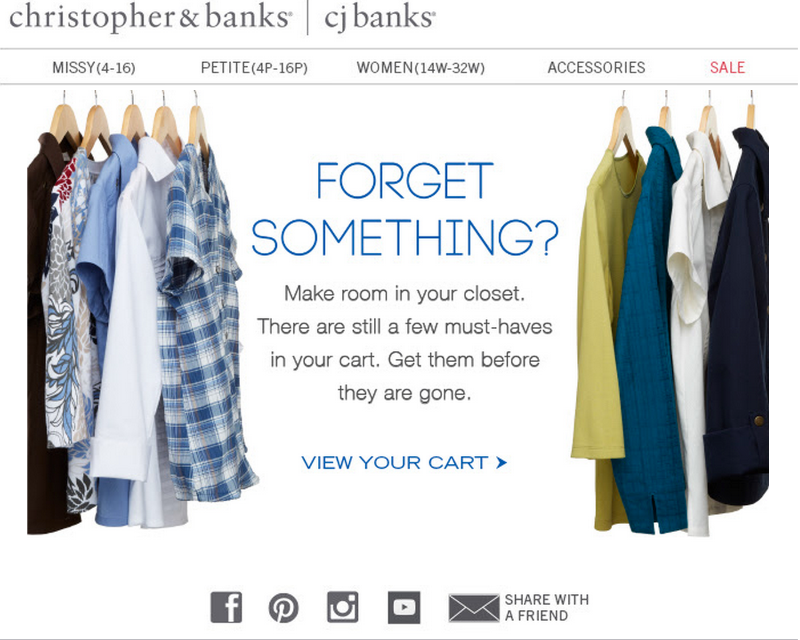
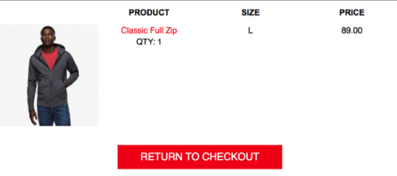
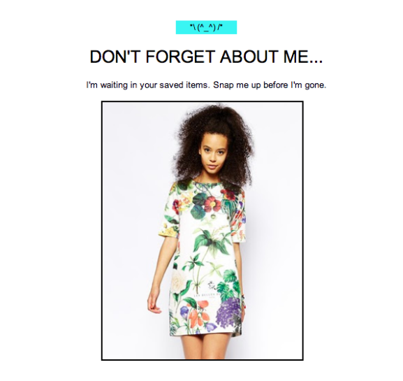
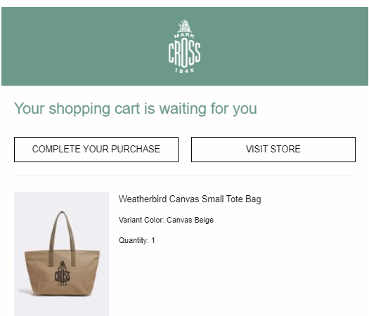
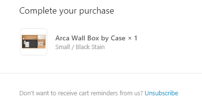

Emails are crucial for Business2Business or Business2Customer interactions, in that case, responsive email designs are what make those interactions fruitful. Well-structured email designs will make your brand stand out from the cluster and it will grapple your audience's attention instantly.

Yes, you need flawless email content to engage with your audience but responsive email designs are those that will project the content in the way it was intended. Most of the organizations spend much expense and effort in optimizing their websites instead of enhancing their email designs which anchor their marketing campaigns.

So, by now there should be a question lurking in your mind, how to design an email that attracts your target audience?

In this article, we have brought you some of the best email design practices followed by organizations around the world that answer your question.

<toc></toc>

---

## What is an email design?

Email design is the practice of designing and fabricating an email to make it visually pleasing and engaging to the customer/client at first glance. A well-designed email should reflect the brand's identity in a way that people are able to recognize your brand as soon as they gaze at the email. When you figure out how to design an email you can elevate your customer engagement and can yield you better conversion rates and sales.

## Why Email template design is necessary?

Email content and Email design are vital in achieving dynamic email marketing. But a great content without an imperative business email design will not entice your customers. So, a well-designed email is necessary to make the content engaging to the readers and also to deliver the intent as quickly as possible.

A badly optimized email will make customer engagement hard. If they are unable to interpret your message in an instant, they will ignore your email or in the worst case, unsubscribe. And this is why you should follow the best email design practices to build a responsive email.

## What role does Email design play towards marketing success?

A recent study says that email marketing is one of the effective marketing mediums pushing SEO, affiliate marketing and Social media to the side. Emails are the base and structure of email marketing. Let's see how email design has an impact on email marketing.

### Elevates traffic & lead conversion

The integral reason why organizations invest their effort in email marketing is to yield better sales conversions and to attract more traffic to their stores. When a customer finds your content and designs hard to interpret it causes them to lose interest in your business. So your email template design should entice your customers and offer them an easier way to engage with you, this will help you to drive more traffic and increase your conversion rate.

### Responsive emails save time

A responsive email template will save time for both marketers and customers. Marketers can add new content to a well-designed email template and send them, instead of spending a tedious time in designing new templates. When your email design is responsive it will save your customers time and they will visit your store to place orders. So, a responsive email template design will help you get faster order thus elevating your sales instantly.

### Boost Click-through rate

The email click-through rate is the number of customers clicked on at least one link provided in your marketing campaign. When you send a responsive email to your customers which is aesthetically pleasing there is no need to worry about click-through rate. Because a responsive email template design will automatically boost your click-through rate.

### Minimize unsubscription and spam rates

The majority of customers access your store or email through a mobile. When customers are unable to open your email on a mobile device due to poor optimization they will unsubscribe or mark it as spam. A responsive email design will make it easier for your customers to read it irrespective of devices which will minimize unsubscription and spam rates.

### Increases your sales

Responsive email design will trigger the interests of your customers which will boost them to make a purchase in your store. Now you can take advantage of this and motivate them to make another purchase in a few ways,

- Showcase the products in the transactional mail that are in demand alongside the products they purchased.
    
- You can list related items to their past purchase.
    
- Offer a discount for their future purchases.
    
Listing these options will give your email design a more consumer-friendly appeal and drive more sales.

---

## Best email design practices to pursue

 

Email design has become a thing of concern for most of the business. Many businesses are baffled on how to design an email, the key to developing a responsive email design is by following a certain code and <link-text url="https://www.retainful.com/blog/ecommerce-email-campaigns-that-could-help-your-drive-conversion" rel="noopener" target="_blank">email marketing design tips</link-text> practiced by organizations around the world. Here are some of the best email design practices followed by organizations around the world.

### Determine your intention

The primary step in best responsive email design practices is figuring out what the email is intended to do. Intention can vary as per the situation it may be transactional email, reminder email, cart recovery email or an appreciation email. You should design your email based on that intention only then you'll fetch an appropriate response.

Let's take a peek at retainful's <link-text url="https://www.retainful.com/abandoned-cart-email-templates" rel="noopener" target="_blank">abandoned cart email templates</link-text>, the main intention in these templates is to remind the customers (who abandoned their carts) to complete the checkout process. The intention can be clearly seen once you take a glimpse at the template and that is why it is crucial to determine your intention before designing an email template.                                                    

 

Customers should be able to interpret your intention with ease and only then they will respond to your intentions. An email with an undetermined intention will make it hard for them to understand and they will just ignore it.

### Fabricating a compelling subject line

The subject line gives an identity to an email, it is a concise statement that grabs the attention of your customers, without a compelling subject an email is pointless. A subject line should be crafted precisely in a way it entices the customer to open it and continue reading.

Always remember, when you use too many CAPS, overcrowded punctuations, or certain sentences will mark your content as spam so use your words wisely while drafting the subject.

Here are a few ethics to follow while writing a subject line,

-   Keep it precise, don't exaggerate
    
-   Avoid crowding your sentence with punctuation.
    
-   Never use 'noreply@company.com' whatsoever.
    
-   Don't craft your subject with ALL CAPS.
    
-   Avoid using exclamations and questions in the same sentence.
    
-   Always initiate with verbs.
    
-   Avoid using promotional languages like 'Free' or 'Buy now' etc.
    
-   Try some humor if it suits you.
    
-   Tell them what's in the email.
    
-   Avoid giving fake assurance to your customers
    
You can view some of <link-text url="https://blog.hubspot.com/blog/tabid/6307/bid/23965/9-email-marketing-best-practices-to-generate-more-leads.aspx" rel="noopener nofollow" target="_blank">HubSpot's best email marketing practices</link-text>to get a better understanding of it.

### Avoid complicated word-play, be transparent

You don't know how your customers' reading skills are, using complicated words will frustrate your readers causing them to ignore your email. Emails are the primary interaction medium between business and customers so use it wisely to boost conversion rates.

Always avoid using obscure or vague sender names, preheaders and complicated subject lines this will fluster your customers. They might end up deleting your email or marking it as spammy content.

Be transparent with your intention to make it easier for your customers to interpret what you are trying to convey and what they are going to get out of this email. Transparency in your email will foster better customer engagement and increase your email click-through rate.

### Deliver precise content

Emails are not essays, to show off your writing skills, draft them with utmost precision and be concise. Because customers are not going to read an email completely they will just take a gaze and look for things that interest them.

A recent study says that emails just have a mere 1.1 seconds to grab the audience's attention, so an essay is not a great idea, and that is why it is essential for an email to be precise and upfront. Draft an email that gives your customers what they need right away, this will make them feel that you respect their time which increases your email subscriber retainment.

The main motive of a marketing email is to increase click-through rates so there is no need to delay the process with lengthy essay type emails. These emails will fluster your audience and cause them to delete the email or mark it as 'spam'.

### Stay in proximity with your brand

As we mentioned earlier, as soon as the customer opens the email he/she should be able to recognize that it is from your organization. Emails should reflect your brand's identity so people will know it's from you just by gazing at it without even looking at the sender.

Here are some tips to keep your email in proximity to your brand,

-   Draft your email with the same fonts and color palette that you use it on your website and other branding.
    
-   Use a similar theme that you use on your website, Social media, and other marketing mediums.
    
-   Always include your logo while drafting an email, add links to your website and product to boost conversions.
   
Designing your email similar to your brand's identity is one of the best responsive email design practices that will make your emails stand out from the cluster and it will give a unique experience to the readers.

### Captivate your audience visually

When you draft an email only with text content it will look monotonous and will fail to capture your customer's attention. The prime motive of email design is to keep your customers interested and engaged in your message.

Adding images or gifs is one of the best email marketing design practices which will make your email visually pleasing to your customers and this will keep them interested in your message. Incorporating images and gifs in your email is effective to grab your audience's attention and to break up the text monotonicity.

**"A picture speaks a thousand words"**

Using Gifs and animation in your email will make the customers understand your intentions effortlessly. While adding images or gif make sure you use the right file format and right size or you'll end up sending an unoptimized email. You must follow the default email template design guidelines while designing the email template to make it both visually pleasing and responsive.

### Have a personalized touch

Email personalization is the activity of using customer data to draft a personalized email to a specific recipient. When you draft an email to a recipient, it feels personalized, this strategy will help you to develop a better relationship with your customer.

Based on a specific customer's travel with your store you can get to know their shopping behavior and send a timely personalized email to them. These types of email campaigns will make your customers feel that these emails were specifically tailored to them.

Go beyond the recipient's name, craft a personalized subject line, a study says that around 26% of emails are likely to be opened when it has a personalized subject line. <link-text url="http://retainful.com/docs/woocommerce/how-to-make-your-emails-personal" rel="noopener" target="_blank">Sending Personalized Emails</link-text> may look time-consuming, but it's not, create a single email template for these campaigns, just change the image and content based on the customer data to make it personalized.

### Strategically place your call to action

Optimizing your email with CTAs will make the readers interested in your message and also it will increase your conversions. You can use CTAs to direct customers to your website, to follow you on social media, etc. CTAs should be clearly visible and visually pleasing to increase the curiosity of readers  

Having a CTA button rather than a link increased the click-through rates by 28%, says a recent study. Buttons are aesthetically pleasing and simple, making it easy to increase conversions. Here are some of the tips to a proper CTA in an email,

1.  CTAs must be action-oriented. Ex - Learn more, Try it for free.
    
2.  CTA button should be clearly visible and legit.
    
3.  CTAs should be short, under 3 or 4 words.
    

 
Even though CTAs are only a small part of your email template, they are the most important elements that a marketing email must need. Because it redirects customers from their email to your website thus increasing your traffic and conversion rate.

### Optimize your layout with white space

White space or negative space is the space given between each element in a template design that will help the reader to interpret the content with ease.

The one question that comes before designing an email is, how to layout an email? When you design an email template by adding more elements near to each other without any gaps it will look clustered and the reader will just skip it without reading it. So, you should always optimize your layout with white space so it looks neat and simple.

Generally, there are two types of white spaces in your emails,

1.  Active white space - Intentionally placed to make it visibly and aesthetically pleasing.
    
2.  Passive white space - Space near the corners and in-between the line and empty unused space.
   
So, manage your white space properly to keep your reader engaged in your email and avoid getting ignored or marked as spam.

### Forge a responsive design

Customers may access your email from any device, your email design template should be responsive to fit the screen by changing the format irrespective of the device. A responsive email design will allow the customers to read it in any format, any type of screen or any device.

A recent survey mobile email design suggests that emails should be optimized for mobile initially. Because 42% of emails are read on smartphones, followed by 40% on webmail, and desktop accounts for 18%. So failing to design the email for mobile view initially will cause a dip in response rates.

Also while designing for mobile and desktops you should follow the best email template practices to make sure they are optimized for touchscreens. When the usability is increased then customers will feel comfortable performing an action directly from the email.

### Choice of unsubscription

Email marketing is effective in driving more conversions to your store. At some point, your customer may want to leave due to various reasons making your email no longer useful for them. So, allow them to quit your service on a high note, by providing an unsubscribe button.

Every marketing email should be designed with an unsubscribe button, which is easily visible and the process of unsubscribing must be simple as it looks. Also, having an unsubscribe link will avoid your email from being marked as spam.

## Summary

A well-designed email is a key to fostering better customer relationships. In this article, we have seen how to design an email and what are the best email design practices to design a responsive email. Responsive email templates will yield more sales and fetch better conversion rates in comparison to default email templates thus playing a vital role in a successful marketing campaign.