Is it any wonder that Shopify is one of the popular eCommerce platforms in the world. That's because it is very agile, and it allows you to create an eCommerce store within a few minutes.

So, now your Shopify store is set up, how will you launch it? Launching a Shopify store is simple, but that's what makes it very tricky, you need to create a pre-launch checklist to achieve a seamless launch.

**Why do I need a Shopify store checklist?**

Well, you need a Shopify launch checklist to open a Shopify store without any confusion. And, where will you get your Shopify launch checklist?

We have compiled an extensive Shopify launch checklist that can ease your mind and help you take an organized approach in launching your Shopify store.

<toc>
</toc>

## What is Shopify?

Shopify is a powerful eCommerce platform that allows you to create and manage an online store. A distinct aspect of Shopify is that you need ‘no coding experience’ to build your eCommerce store. Shopify is a leading eCommerce store builder that suits business of any size.

## How does Shopify work?

Shopify can help you create a store irrespective of your business. You might be a photographer who wants to sell portraits or a jewelry designer who needs a store to sell jewels, Shopify has got you covered.

Here is a list of things you can sell using Shopify store,

-   Physical products like jewelry, electronics, etc.
    
-   Digital products like audiobooks, ebooks, etc.
    
-   You can sell in-person consultations and services.
    
-   Sell your memberships
    
-   You can sell online tickets like plane tickets, concert or event tickets, etc.
    
-   You can create and sell classes and lessons in your Shopify store.
    
Adding and organizing your products, accepting payments with debit/credit cards, or via online transactions can be done with ease when you open Shopify store.

Shopify also allows you to track the orders placed with ease and respond to customer queries through dynamic customer support.

## How to set up a Shopify store?

In theory, you don’t need ‘coding experience to figure out how to launch your Shopify website. It has a straightforward and intuitive interface that allows you to open a Shopify store with ease.

Let’s discuss the step-by-step process involved in creating your online store.

### Select a domain and sign up to your store

Before you launch your store, you need a name that represents your business in the market.

Don’t spend too much time selecting your name; keep it short and neat. A word of advice, using the ‘shop’ ‘store,’ will make it easier to find a domain.

You might be wondering, how can I find a proper name?

Check for name generator tools; these tools will provide you with multiple suggestions and make your process simple.

 

Enter the name you prefer in the name generator tool. The tool will cross-check it with the domain name database and check if your domain name is available.

Once when you find a suitable domain name, you have to register the same name as your store’s domain name. Here are a few <link-text url="https://www.oberlo.in/blog/free-business-name-generators" target="_blank" rel="noopener nofollow">name generator tools</link-text>that would help you find suitable ones and you can also <link-text url="https://www.namecheap.com/" target="_blank" rel="noopener nofollow">book your domain name</link-text> in a few clicks, it’s that simple.

Now, you have to sign up for a Shopify account. Navigate to Shopify → Start free trial.

Enter your email address and password. While mentioning the store name, make sure you use the same name that you used as your domain name.

See, that’s how easy it is to create a Shopify account, it takes a mere three steps. These details are essential for your payment processes, so play it wisely.

### Design your Shopify logo

Index of the business is crucial; a logo is what represents your brand to the market. So, design your logo wisely when you open Shopify store as it reflects your brand identity.

There are plenty of tools available in the market to design a logo, but let’s talk about Shopify’s very own logo maker.

Introducing Hatchful,

Hatchful allows you to create professional logos for your business effortlessly irrespective of your design experience.

This intuitive tool possesses an infinite design capability with thousands of templates and hundreds of color combinations to suit your design needs. Here are a few features of hatchful for your consideration,

-   Hatchful is free to use.
    
-   You don’t need to be experienced to use hatchful.
    
-   It has a pool of logo templates.
    
-   This tool comes with a social branding package.
    
-   Hatchful has an intuitive and simple design studio.

A logo is crucial for brand awareness; with hatchful, you can create the best logo that captivates your audience.

### Adding products and pricing

Adding products to your store will get you started with the website. Always organize the products, descriptions, and images accordingly before uploading it to the store.

Organizing these components after uploading them to your store is a tedious job. Here is a quick overview of how to add a product to your Shopify store.

Step 1 - Go to your Shopify admin, navigate to Products → all products

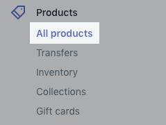

Step 2 - You’ll land on the product page, click ‘add product.’

Step 3 - Mention the product’s title and some additional information.

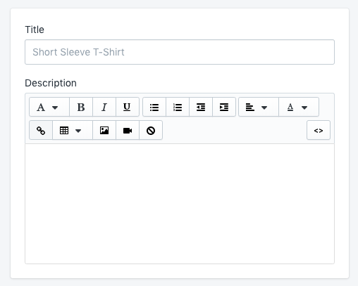

Step 4 - Click ‘Save’

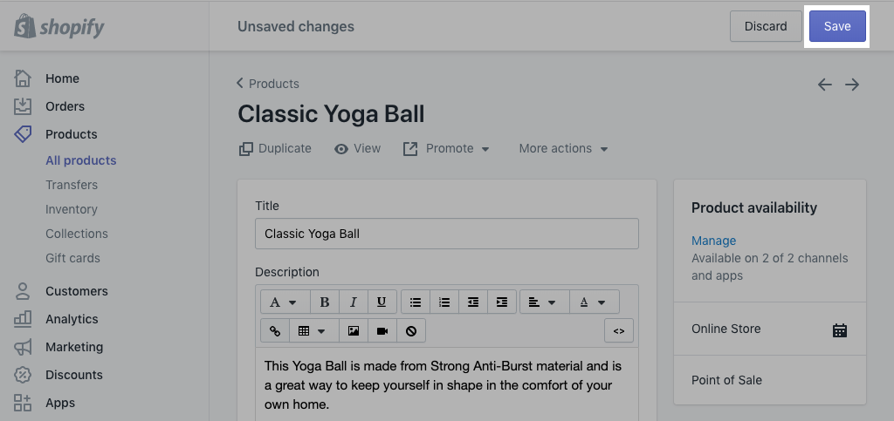

Yes, just four steps, that’s how easy it is to add a product to your Shopify store.

**Setting product price**

Setting prices to your products is simple too. When you are adding your products to your store, you can set your prices. Set your product prices higher than what you spent on purchasing it from the manufacturer.

The price that your supplier charged you is the product cost. Your profit is the difference between your product cost and the amount of the product in your store, so set it high.

Step 1 - Go to your Shopify admin, navigate to Products → All products.

Step 2 - Select ‘Add product,’ enter the product details.

Step 3 - Scroll down to the pricing section and set your sale price.

Step 4 - Click ‘Save’

Check the box if you want the product to be tax inclusive/exclusive.

### Writing product description

Your store is a digital medium, meaning, people cannot physically hold the product to check if it suits them or not.

So, you have to entice the customer and make them interested in your product with your content. A product description is crucial for an online store; it is essential to put necessary thought into drafting it.

Write a product description that provides all information about the product, which will make them curious to purchase it.

Step 1 - Navigate to Products → All products

Step 2 - Under the Add product section, you can add the product and description.

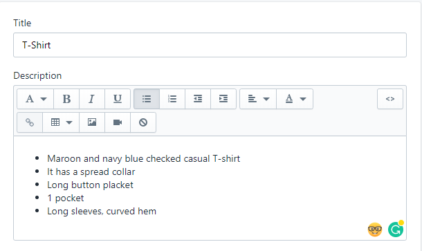

Here are a few tips for writing the best product description,

-   Draft your product description with vocabulary & tone that suits your audience.
    
-   Avoid using the manufacturer’s description; they are void.
    
-   Point out the benefits of the product.
    
-   Make use of the bullet points for easy scanning.
    
-   Optimize the description with keywords.
    
These tips can help you create the best product description that answers your customer’s questions and motivate them to purchase.

### Adding product images

Customers love to see products visually before they make a purchase decision. Great product photos increase your conversions.

A best practice is to take your product photos by yourself using a digital camera. You can capture it in any way you want and upload it to your store.

Around 60% of people look for at least 3 to 4 images per product, before they make a decision.

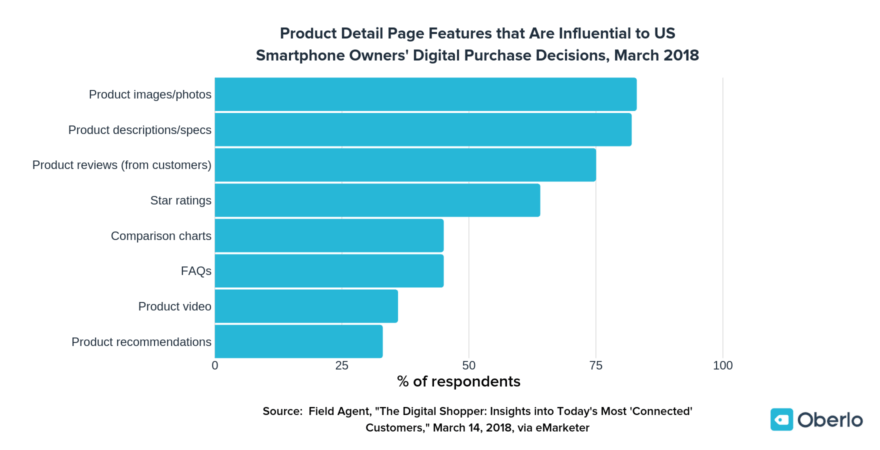

This chart will show you how much product images are necessary for your store.

But if you feel like capturing your own photos is tedious, you can download it from royalty-free sites like,

-   Unsplash
    
-   Shopify’s Burst
    
-   Pixabay
    
-   Pexel
 
If you have a bigger budget, you can always add stock images in your store from,

-   Shutterstock
    
-   iStock
    
-   Dreamstime

Let’s see how to add photos to your products in Shopify,

Step 1 - Navigate to Product → all products

Step 2 - Under the ‘media’ section, click ‘add file’ to upload the images.

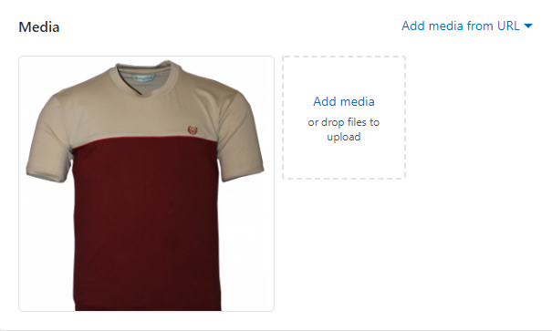

Add more product images to make your customers more confident about purchasing the product.

### Set up shipping details

Digital products like ebooks, audiobooks don’t need shipping, so you have to uncheck the ‘This is a physical product’ box

Check it only when you are adding a physical product.

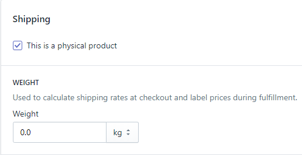

For physical products, you have to mention the weight of the products.

An effective strategy to increase your sales in your online store is by offering free shipping to customers.

You can set free shipping as default in your Shopify settings,

Step 1 - Navigate to Settings → Shipping → General shipping settings.

Step 2 - Click ‘create shipping zone,’ enter the zone name, and choose ‘rest of the world’.

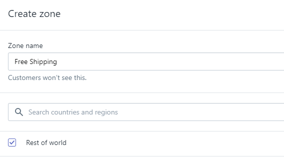

Step 3 - Now that your Shipping zone is created, you have to specify the rate of shipping. Click ‘Add rate,’ and specify the price.

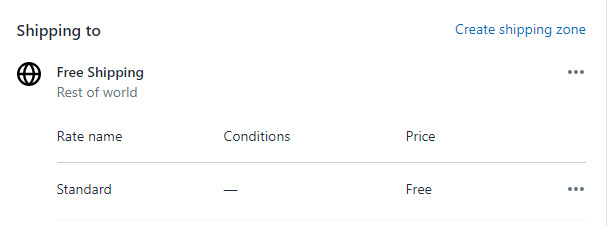

In the case of free shipping, the price is free.

### Create an information page

Every store needs an information page or legal page. You can create them on your own or you can use a template and then customize it.

To keep your store safe and secure, it’s not possible to add videos, audios, or other media in your legal page. Here is the list of legal pages you need to create,

-   Refund policy
    
-   Privacy policy
    
-   Terms of service
    
-   Shipping policy

Navigate to Settings → Legal

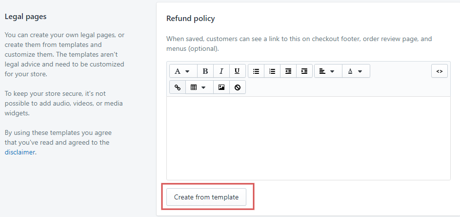

### Remove your password protection

Once you’ve customized all the components in your store, you need to open it for the public.

By default, stores are protected by password, remove the password, and make your store open for the customers to visit.

## Why do you need a Shopify store checklist?

Products, product images, and all other components have been added to your store and it is ready for launch. As there are a lot of moving parts in the store, you have to double-check every smallest component.

It’s easy to miss a crucial component because of negligence, and it will cause you a lot of troubles during your launch.

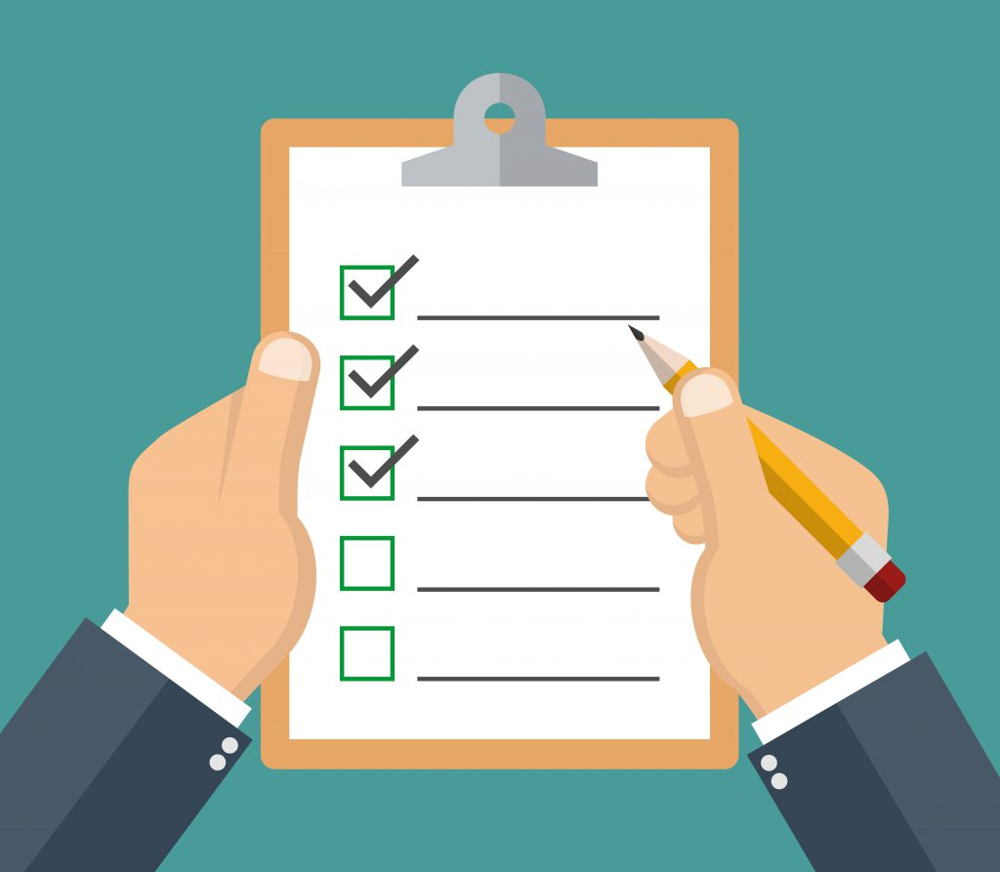

That is why a Shopify launch checklist is essential before you open Shopify store. An eCommerce store checklist can streamline your launch process without any errors.

The eCommerce store checklist covers what you need to do and guide you through the launching and promotion of the store. We have compiled a Shopify launch checklist to follow while launching your store.

## 13 Ultimate Shopify setup checklist in 2020

### Add a dynamic sales channel

The primary step in the eCommerce store checklist is adding sales channels in your Shopify store. With this, you can sell and market your products across multiple platforms like,

-   Amazon
    
-   eBay
    
-   Google shopping
  
You may wonder, <link-text url="https://blog.hubspot.com/sales/channel-sales" target="_blank" rel="noopener nofollow">why should I add sales channels to my store?</link-text>

A survey from Harvard shows that around 7% of people prefer buying online; the customer base is rapidly turning multi-channels; approximately 73% of customers use multiple channels to complete a single purchase.

Do you want the benefits of multi-channel retailing in your store, then you’ve to add necessary sales channels to your store.

As all these sales channels are connected to your Shopify interface, tracking orders across multiple platforms can be done effortlessly.

### Select a custom domain for brand recognition

As we discussed earlier, a domain name gives you an identity in the market, and it should be as similar to your store name.

Domain name lets people recognize your brand, so choose it wisely, but don’t fret too much on it, keep it simple, or better use a name generator.

With a name generator, you can do a domain name search to find a suitable name, and when you find a name that isn’t a trademark of any other business, you can purchase the domain directly via Spotify.

If you can’t find the right domain name that suits your store, you can try out a few top-level-domains. The .com part is the tld, but you could’ve seen some variations like .gov or .in, etc.

Driftaway.coffee is an example of top-level-domains, .shop or .store are common top-level-domains in eCommerce.

### Add and organize your products

Organize your products as per their categories before uploading it in to the store because organizing it post-uploading is a tedious task.

Before launching your store, make sure you have added all the variants of a product, be it color, size, type, etc. Wait, you might think, how do I add a product variant?

You can add a variant while creating the product.

Step 1 - In the add products page, Check the variant box if the product has multiple options.

Step 2 - In the ‘option 1’ box, specify the size of the product and click add another option if your product has more than one option.

Step 3 - This will open ‘option 2’ where you can mention the color.

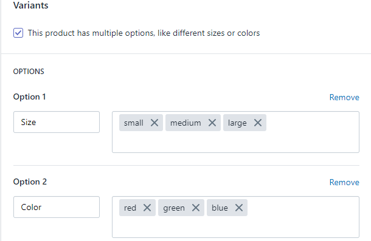

Step 4 - You can add the prices for every variant according to size, color, and material.

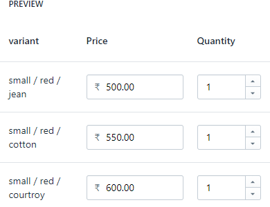

Step 5 - Click ‘Save’

Your store has many products and hundreds of variants for the product. So it is essential to open Shopify store and check if all the products are categorized accordingly to avoid confusion.

### Review shipping details and taxes

Shipping rates are what you charge your customers apart from the product price, to ship the product domestic or overseas. These costs are generally added during the checkout process.

You should check your shipping rates as per your Shopify store checklist before launching your site or you may miss out on huge profits that can be earned when you ship internationally.

In some cases, you can also use your shipping rates as a marketing tool by providing free shipping to your customers.

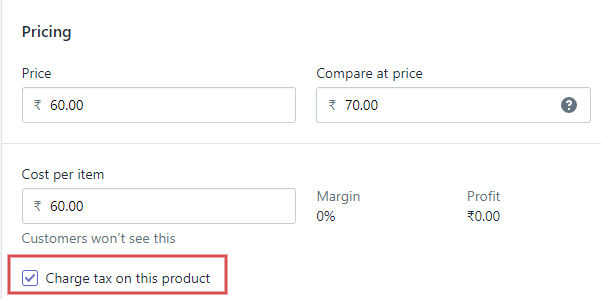

Your customers can access your products from any part of the world. So you need to make sure the products are available inclusive of taxes. You can hire an accountant if you are not sure about the taxes.

### Analyze your payment gateway

Reports say that there is a 23% increase in online shopping in the past couple of years. People nowadays prefer eCommerce to conventional shopping because of its security.

Payment gateways allow online stores to have top-notch security while accepting online transactions through cards, PayPal, Google, etc.

So you must double-check this step in your Shopify setup checklist to make sure it is secure and has no chance of credit card frauds.

Shopify has an in-built fraud analysis that can alert you when a suspicious transaction is happening. So make sure you run a test transaction under your Shopify store checklist before you launch your store to the public.

### Cross-check your email settings

 

Once your store is up and running, you need to promote your store to your customers through your emails. You have to <link-text url="https://www.retainful.com/blog/how-email-template-designs-play-a-huge-role-in-a-marketing-campaigns-success" target="_blank" rel="noopener">customize your email templates</link-text> and send them to your customers to create a better relationship with them.

In your Shopify store, multiple emails need to be customized before you launch the store. You have to <link-text url="https://help.shopify.com/en/manual/sell-online/notifications/edit-templates" target="_blank" rel="noopener nofollow">edit your templates</link-text>if you want to build your email list and drive more sales.

You can add email marketing apps like seguno to send customized emails to your customers like,

-   Welcome emails
    
-   Transactional emails
    
-   Order confirmation emails
    
-   Shipping and other notification emails
    

 

Shopify has apps like <link-text url="https://www.retainful.com/abandoned-cart-recovery" target="_blank" rel="noopener">retainful</link-text> is specialized in sending cart recovery emails and next order coupons via email. It has hundreds of email templates which can ease out your effort.

Customizing your emails before the launch is a priority in the eCommerce store checklist as it will help you get right on with your email marketing campaign as soon as you launch your store.

### Proofread and refine your content

Generally, one part of your store is made of products, the other part is made of contents. Static content is essential for any store, so proofread your content is crucial in your eCommerce store checklist.

But, refining the store’s content is often overlooked in the Shopify launch checklist. Small content elements like broken links, grammar, and spelling errors would go unnoticed and may cause troubles post-launch.

A study says that around 60% of customers will be curious to know about the brand values before they initiate a purchase. Homepage, information page, blogs are the things that customers checkout on the first hand.

So, proofread and refine all your pages content to give a memorable reading experience to your customers.

On the technical side, you must also check for broken links, 404 errors, and unoptimized images before you launch your store. Make sure your content is SEO optimized to drive more conversions.

### Optimize all the images in your store

Images make your store visually pleasing and help customers in making a purchase decision. But, did you know that images can slow the speed of your website?

Yes, unoptimized images can rattle your store’s user experience and performance. Unoptimized images can cause trouble when your store is on a flash sale; it will affect your reputation.

So, it is crucial to follow your eCommerce site checklist and optimize the images before launching the Shopify store. Let’s see how to achieve it,

**Use keywords while naming images** - This will boost up the SEO ranking of your store and other pages. Keywords can drive you more conversions.

**Minimize your image size** - Store’s can use compressed images, so reduce the file size of the images before uploading it. You are not printing, to use a high-quality image.

**Enhance your alt attributes** - Alt attributes provide alternative info of the image and also increases web accessibility. Make sure you enhance it with keywords.

**Select the proper file type** - It is recommended to use the file type .jpg & .png, at times, you can also use .gif type images.

**Test the images before launching** - You may need to run A/B testing to check out what image is working and what is not working and why it isn’t working to figure out a solution.

These guidelines can help you optimize your images and make your store function seamlessly after the launch.

### Set up analytics tool to monitor your metrics

Monitoring the performance of your store and reviewing the insights will ensure business success. Analytics should be installed right from the store’s inception to view insights into your customers.

Shopify has an in-built analytics tool that can help you measure your metrics. With this tool, you can get details on all the basics, including the return customers rate, store conversion rate, average order value, and total sales.

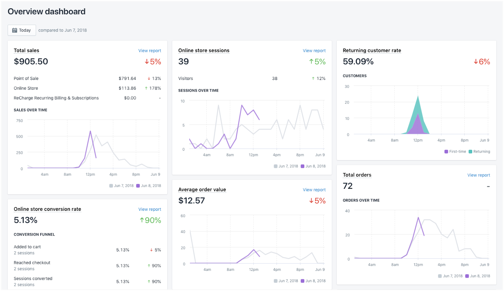

 

Even though Shopify’s analytics tool covers it up, you can also install a third-party tool like Google analytics and strike off this step from your pre-launch eCommerce store checklist.

### Focus on your marketing plan

Now your Shopify store is ready to launch, but it will not fetch any sales if people are unable to find it. You need to strategize an effective marketing plan before you launch your store.

A recommended practice is to document the marketing plan so that once you’ve launched, all you need to do is follow the documented guidelines.

Shopify allows you to create a marketing campaign to promote your business with simple marketing tools. You can engage in audience-building activities to <link-text url="https://www.retainful.com/blog/9-ways-to-drive-traffic-to-your-online-store" target="_blank" rel="noopener">drive traffic to your Shopify store</link-text>.

 

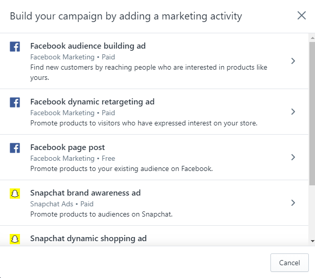

Marketing campaigns in Shopify can help you create social media ads to boost up the chance of a sale and increase your brand awareness.

So, focusing on your marketing plan before the launch as per your eCommerce store checklist will keep you relieved post-launch.

### Test your store for every possible outcome

Once your store goes live, it would be too late for issues. Even Though you checked every component of your store before the launch, you might have missed the vital step in your Shopify Launch checklist;

“Customer’s perspective”

Your store will look different in the eyes of your customers, so you should test your store as a customer. Here is a list of what should you do as a customer for your store,

-   Check how fast is your website
    
-   Check the accessibility of the store
    
-   Make sure the contents are easy to interpret
    
-   Check how the store navigates a customer through their journey
    
-   Check how user-friendly it is.

Access your store like a customer would, review your content for errors, and check if the products are distinguished right as per their categories and variants.

You can place a trial order to see how the checkout page works and how fast it is. Double-check your payment gateway and see how secure it is.

As a developer, everything may seem great from your perspective, so ask your colleague or friends to test your store and sort out if any issues persist. Test, test, and test to strike off this step from your Shopify setup checklist.

### Add only essential apps

Stuffing your store with too many apps at the initial stage will cause your store to slow down or crash. You don’t need that happening in your new store.

Some apps won’t even be necessary for a new online store. So, it is wise to take things periodically.

When you are gearing up for the launch, install only the most essential apps as per your eCommerce site checklist depending on your industry. You can add the rest once your store gets up and running.

### Make customer support simple and effective

Customers will have many queries to sort out after the store is launched. Make it easier for customers to contact you so they can find a solution to their questions.

You’ll have to mention your address, contact number, and live chat in all the pages.

A recent study shows that the size of the cart increased by up to 48% when store owners chat with site visitors. With proper customer support, you can increase your brand value.  

Customers are more likely to return to your store when they feel you valued their presence in your store. Customer support may be a minor step in your Shopify launch checklist, but it is the most effective one.

## Summary

Shopify is a powerful eCommerce platform designed to help you create an online store. Once your store is ready, the best way to launch a Shopify store is by following your eCommerce site checklist.

In this article, we’ve crafted a guide on how to set up your Shopify store. Also, we did our research to compile a 13 step ultimate Shopify setup checklist you need to follow before you launch your Shopify store.