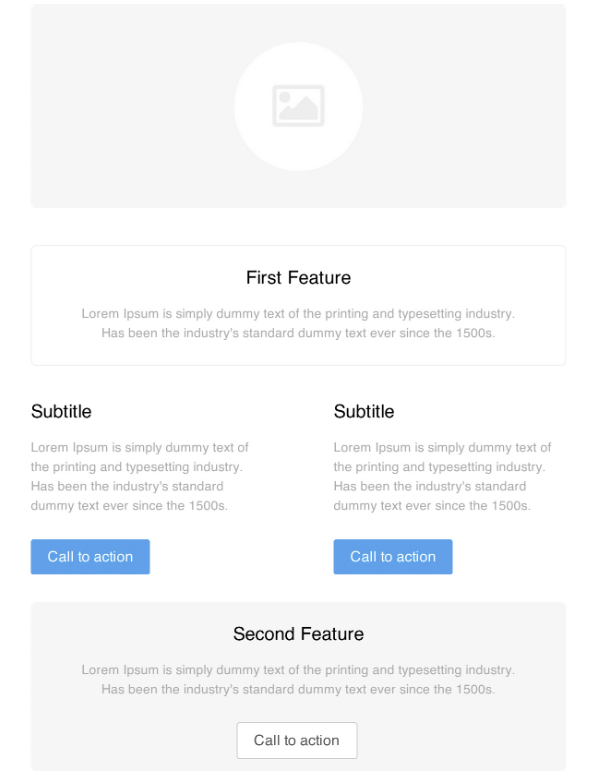
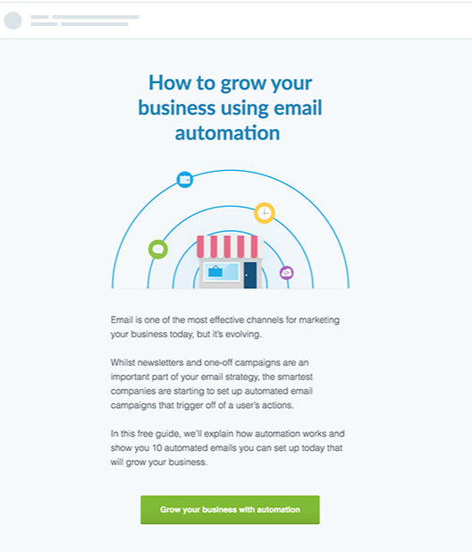
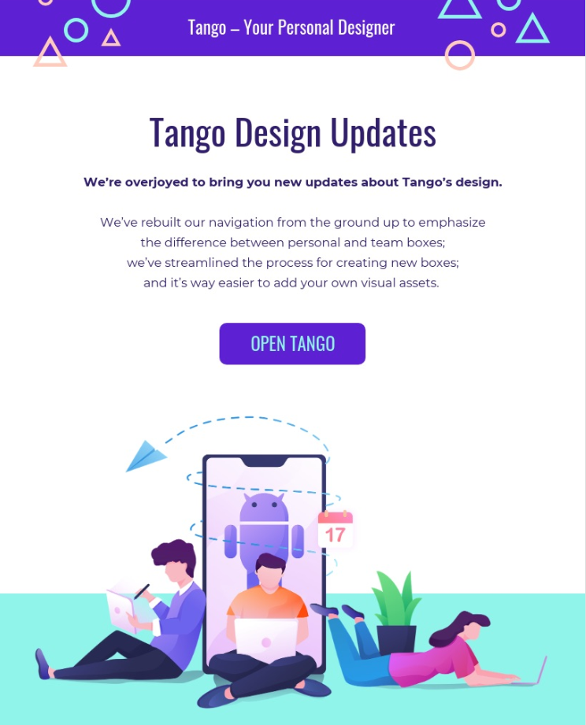
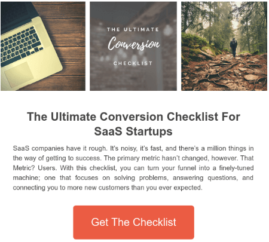

With a projected 5.6 billion users around the world by 2020, an email newsletter is one of the finest marketing mediums to acquire new leads, boost brand awareness and foster better engagement.

Newsletters are more agile and effective than Facebook. But if no one prefers to read your newsletter, it is just another spam content in your customer’s inbox.

So, How to write a newsletter that people would like to read?

Then the first thing you have to do is determining the goal of your newsletter. Want to know more?

Follow this article to find out what is a newsletter, how to write a newsletter and some of the best email newsletter practices to make people commit to your newsletter.

<toc>
</toc>

## What is a newsletter?

Email newsletter is a form of communication sent to inform subscribers about new offers, updated inventory, and other store/product related news. It is the most effective marketing strategy to foster better engagement with subscribers. They can be used for a variety of purposes and can be of any form.

The motive of creating email newsletters is to remind customers about you and your products. When used strategically it can drive more conversions and that is why newsletters are crucial for the success of email marketing.

---

## What are the benefits of email newsletters?

Businesses need professional newsletters to provide updates to users regarding products and services. It is not something that is used to keep in touch with customers it is more than that. Here are some of the benefits of professional newsletters,

**Better engagement**

Engagement is what customers want in this digital era and there is no other better way to build it with newsletters. When you build better engagement with them you can encourage your customers to perform an action like purchasing a product or reading your blog. They will not hesitate to do it because they’ve entrusted your brand because of your newsletter.

**Boost your sales**

A recent study shows that people spend 138% more on purchases marketed through email than people who don’t receive emails. So just look at the huge sales opportunity you are missing out if you don’t have a newsletter.

People are impulsive so offering a discount will motivate them to visit your store to complete a purchase.

**Increases your brand value**

You can build your credibility with email newsletters by sharing your knowledge with them. This will increase your brand value and customers are more likely to reach out to you when they need some help. Professional newsletters are an effective way to build trust and foster loyalty.

**Drive more traffic**

Email newsletters are the best way to <link-text url="https://www.retainful.com/blog/9-ways-to-drive-traffic-to-your-online-store" target="_blank" rel="noopener">drive more traffic to your store/website</link-text>. Optimize your newsletters with CTAs to products, blogs or stores to redirect them as you prefer. You can also add social sharing buttons in your newsletters so your customers can share your content on their social channels.

**Affordable marketing strategy**

A recent study shows that "email marketing generates a profit of 44$ for the expense of 1$." And almost 81% of small businesses use email marketing as their prime procurement channel because small businesses don’t have the luxury of affording over the top marketing techniques. It is safe to say that email marketing has proven its worth among small business and they’re evolving rapidly

---

## How to select the best newsletter topics?

Your newsletter will be judged based on its topic, so choose a newsletter topic that lures your subscribers into reading it. Select the best topic that appeals to the interests of your reader. Newsletter topics should create a feeling of solving a reader's queries in just a click.

**Example -** 7 Productive things to do in quarantine, Top 10 books to read during a lockdown, etc.

**Here are few tips to select the best newsletter topics,**

-   Keep it short and simple to understand.
    
-   Avoid over experimenting with the topic, basic topic.
    
-   Newsletter topics should expose its main content.
    
-   Newsletters Topics related to present events grabs attention.
    
-   Avoid choosing spammy titles.
    
-   Test a few newsletter topics to see which has high conversion rates.
    
If you want to develop a better customer engagement then choose a few memorable newsletter topics and test it out. Here are some of the <link-text url="https://www.verticalresponse.com/blog/75-email-newsletter-content-topics-you-can-use-asap/" target="_blank" rel="noopener nofollow">best newsletter topics</link-text> that can flatten out your options.

---

## Measuring email newsletter metrics

Email newsletters are obsolete if you don’t measure its metrics or don’t monitor its performance. Resources and time you put in writing a newsletter will go in vain if they are not achieving the intended conversion.

That’s why measuring the performance of your newsletter is crucial.

Take a look at the number of click-through rates your newsletter is achieving, if the rates sink, you need a new writing strategy.

Your newsletter may contain multiple CTAs, so check which links have the most click-through rates and adjust your strategy accordingly.

**What metrics should I track for newsletter success?**

 Bounce rate, delivery rate, spam complaint rate, the list goes on. Here are some of the <link-text url="https://writtent.com/blog/10-metrics-to-track-your-newsletter-content-success/" target="_blank" rel="noopener">crucial newsletter metrics</link-text>you should be monitoring.

---

## Best email newsletter practices to follow when you write an email newsletter

### Analyze the necessity of newsletter for your business

So, you’ve figured out what is a newsletter and now you should analyze whether you really need it?

At times, the need for an email newsletter can be minimal because of your business goals or you might already have a marketing strategy that is more effective than emails.

Or sometimes your business might be in an undeniable need for email newsletters. Be it you’re promoting a new feature/product or you are resuming your services after a long time so you need email newsletters to drive more conversion and boost sales.

This is why it is crucial for you to analyze the necessity of email newsletters or you’ll only be wasting your valuable time and effort which could’ve been spent effectively.

So, once you’ve figured out your need for email newsletters let's take a look at some tips on how to write a newsletter.

### Design a distinct template

Designing a distinct template is a clever strategy because you can reuse it again and again. Templates save you a lot of effort and time, all you need to do is change the name and send it to multiple customers.

Consistency is key to fostering customer satisfaction and templates can help you achieve it. One of the best newsletter practices is maintaining a consistent template throughout your marketing campaign.

A template with drag & drop functionality is the most suitable for email marketing. Because you can drag any element like image, videos and drop it at the right spot.

Keep your design simple and easy to get engaged. Don’t even try to experiment with it.

Because only when your readers are able to interpret your newsletter without much effort they will most likely click on the links you’ve provided thus boosting your click-through rates

### Craft a catchy subject line

Yes, your users have subscribed to your newsletter but that doesn’t mean they are going to read it when you send them.

So, how do you get them to read it?

Craft a compelling subject line that entices your customers and make them believe that your newsletter is related to them which will motivate them to read it.

You should be able to create FOMO (Fear Of Missing Out) with your subject line so users will know that they have to act quickly. How will you do it?

-   Keep the characters under 50.
    
-   Avoid going ALL CAPS and spammy words
    
-   Begin with a verb.
    
-   Don’t promote in your subject line.
    
-   Use your humor sense, be reasonable
    
-   Avoid too many punctuations.
    
Follow these tips to write a subject line and create a sense of urgency, so your users will open your newsletter to avoid missing out.

### Keep your content less promotional

An email newsletter is useful only when your users read it, but if your content looks something like a promotional ad it is going to end up in a spam folder.

Don’t try to promote your products in newsletters, instead try sharing some valuable, educational information to your subscribers that’s what professional newsletters are meant for.

Always remember the classic ratio of 90/10%. Yes, your newsletters should have only a 10% promotion and 90% of resourceful information.

If they feel you are pushing your promotions against them they are likely to unsubscribe.

The goal of newsletters is to engage with subscribers not to chase them away. Unless you have a crucial announcement about your business or product, stay away from promotions.

### Draft a visually pleasing content

Drafting attractive yet visually pleasing content is one of the best newsletter practices. Because newsletters are sent directly to readers via email so only an engaging content will boost conversions.

**Here are a few tips to write visually pleasing content.**

-   Optimize your content with necessary white space, avoid overcrowding
    
-   Use appropriate shades that keep readers focused on the content.
    
-   Use royalty-free images, avoid copyrighted photos.
    
-   Always draft your newsletters in readable professional fonts.
    
-   Make sure you use a distinctive template that keeps readers interesting.
    
-   Keep your color scheme similar to your business logo.
    
-   Break your monotonous content by using subheadings.
    

A notable tip to make your content visually pleasing is adding an image. A well-designed newsletter should have a balanced text and images.

Readers will be attracted to images as soon as they open it and also get engaged with your text at the same time. But always remember not to overdo it, keep it simple and elegant.

### Make your newsletter personalized

The best newsletter practice is to mention your reader’s name in the subject or in the content to make it look personalized and boost click-through rates exponentially.

If you notice, most subject lines of professional newsletters aren’t personalized. But if you add a name in your subject line it conveys a couple of things,

1.  It says the newsletter is for a specific customer.
    
2.  It shows that the company cares for the reader.
    
Customers will be motivated to read it when the newsletter is personalized for them. Around 26% of emails were opened when it has a personalized subject line.

It is a well-known fact that personalization leads to huge wins as long as email marketing is concerned. This strategy will help you build better engagement with your customers.

### Create concise and snappy content

People don’t like to sit around and read a long boring paragraph, they want facts. If you want people to read your newsletters you have to be precise with your content.

Marketing experts have pointed out that newsletters should range between 200 to 500 words. Snappy content leads to happy readers.

Put yourself in the shoes of your readers, and think realistically how much time you have in a day to check your emails. When you figure it out you’ll know how much information you can share with your reader.

**Here are few tips for creating concise content,**

-   Perceive what your readers want and then start writing the content.
    
-   Don’t start your content with the goal of 200 words, you’ll end up missing out too much.
    
-   Write your content as you always do, then cut it out to make it snappy.
    
-   You can always send professional newsletters in two parts if your content is long.
    
If you draft a long monotonous content, your newsletter is more likely to end up as spam. The main motive of the newsletter is to increase conversion rates so keep your content snappy.

Provide your audience only with the best information thus saving their time which boosts your credibility and trust.

### Provide necessary call-to-action

**Why do you invest your time and effort in sending newsletters?**

To boost up your conversions, right!

You can add necessary CTAs to encourage your reader to perform an action. You can use multiple CTAs as you wish based on your requirements.

**Few CTAs you can add in your newsletter,**

-   Visit your blogs
    
-   Check out your products
    
-   Share your newsletter on Social media
    
-   Complete a purchase.
    
-   Pre-register for a product
    
CTAs must be attractive with a catchy content. Here are some tips for creating the best CTAs,

 -   Communicate with readers directly, use the first-person pronoun.
    
-   Use an approachable action verb.
    
-   CTAs should be clearly visible.
    
-   Remember to keep it short.
    
-   Create a sense of urgency.
    
-   Add directional cues for CTAs.
   

Always use buttons for CTAs, people tend to be more enticed towards buttons than links.

### Keep it consistent

Let your customers know that you care for them and their opinions by having a consistent connection with them through newsletters

Acquiring the right audience is hard and sustaining them is even harder.

That is why it is essential for you to invest consistent efforts to foster loyalty.

If you can’t commit to your newsletter schedule, then there is no way your audience will commit to you.

You want your customers to commit to your newsletters? The only way you can do it is by maintaining a precise timeline for your publications.

Reader’s will lose interest in your newsletters if you are sending them occasionally or without a proper schedule.

Reading your newsletter should be a priority to your customers, not a choice of ‘I may read it or I maynot’. So always remember to be consistent with your newsletter schedule.

### Make it simple to unsubscribe

Having an unsubscription button seems like a bad idea, but it is essential. Stay true to your readers, if they are uncomfortable with your service, make it easier for them to unsubscribe.

This will help you figure out your active subscriber list. Also, a clear unsubscription button will help you <link-text url="https://www.retainful.com/blog/best-practices-to-keep-your-emails-out-of-the-spam-folder" target="_blank" rel="noopener">keep your emails away from spam</link-text> folders.

 

Unsubscription can also help you learn from your experience and re-evaluate your marketing strategy.

---

## Conclusion

If you are worried that you are not achieving intended conversion, don’t sweat it. Just follow some best email newsletter practices and make a few tweaks to your professional newsletter.

In this article, we stressed on what is a newsletter and how to write a newsletter by following some of the best email newsletter practices. Now it is time for you to draft a perfect newsletter and send it to your subscribers.

Go ahead! Don’t keep them waiting for long!